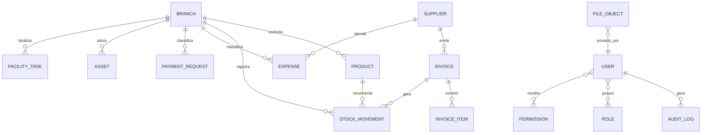

# Matriz Tecnica De Alto Nivel - Piloto 3A RIVA

Este e o artefato do Portao 1 do framework SDD aplicado ao piloto de reconstrucao do Sistema Administrativo 3A RIVA. Ele consolida, em altitude de matriz, os insumos tecnicos (varredura do codigo legado), de negocio (politica de desenvolvimento esperada) e visuais (telas de referencia) em uma visao unica, revisavel por negocio com apoio tecnico, antes de qualquer roadmap detalhado, design tecnico ou implementacao.

Regra de altitude aplicada: ficam aqui decisoes estaveis, fronteiras, escopo, riscos, seguranca, modulos, entidades e fluxos criticos. Detalhes que tendem a mudar quando o codigo comecar (schema final, nomes de claims/scopes, contratos de API, cardinalidades e FKs definitivas, provider de OCR) ficam para o design tecnico ou roadmap detalhado e estao marcados como tal.

## 1. Metadados E Status

| Campo | Valor |
| --- | --- |
| Projeto | Reconstrucao do Sistema Administrativo 3A RIVA (piloto SDD) |
| Escopo | `global` (plataforma administrativa interna com modulos Auth/Admin, Estoque, NF/OCR, Financeiro, Orcamento, Patrimonio, Facilities, Dashboards e Auditoria) |
| Area solicitante | Administrativo 3A RIVA, com apoio de TI/Seguranca |
| Responsavel pela validacao | PENDENTE - definir responsavel de negocio (Portao 1A) e responsavel tecnico (Portao 1B) |
| Status | `Rascunho` |
| Versao | `v0.4` |
| Data | 2026-06-15 |
| Stack-base prevista | Next.js + TypeScript, Firebase Auth, Supabase Postgres, Prisma, Firebase Storage, Vercel |
| Artefato seguinte | Roadmap macro |

Status permitidos: `Rascunho`, `Em revisao`, `Validada`, `Substituida`.

## 2. Resumo Executivo, Objetivo, Escopo E Fora De Escopo

### Resumo Executivo

O Sistema Administrativo 3A RIVA centraliza e padroniza processos administrativos internos hoje dispersos em planilhas e controles manuais, cobrindo Estoque, Notas Fiscais, Financeiro, Orcamento Operacional, Inventario Patrimonial e Facilities, com administracao de usuarios e permissoes. Existe uma primeira versao funcional construida em ferramenta low-code (Lovable), que serve como prova de conceito e referencia de fluxo e identidade visual. Este piloto reconstroi a solucao sobre uma stack proprietaria e segura por desenho, mantendo o valor operacional ja validado pela area e elevando seguranca, rastreabilidade e governanca a requisitos de fundacao.

### Objetivo

Reconstruir a plataforma administrativa interna da 3A RIVA com seguranca por desenho, autorizacao server-side e auditoria minima desde a fundacao, preservando os fluxos e o valor de negocio da versao atual e corrigindo as fragilidades estruturais herdadas do sistema legado.

### No Escopo

- Autenticacao, cadastro com aprovacao administrativa, status de usuario, papeis e permissoes por modulo/acao/escopo.
- Estoque: produtos, movimentacoes (entrada/saida/ajuste), colaboradores e indicadores.
- Notas Fiscais com OCR/IA: upload, extracao, revisao, aprovacao e geracao de entrada em estoque.
- Financeiro: despesas de cartao corporativo, solicitacoes de pagamento, fornecedores, anexos, relatorios.
- Orcamento Operacional: orcamento por ano, mes, filial, macrobloco e categoria; consumo realizado versus orcado; despesas recorrentes.
- Inventario Patrimonial: cadastro, listagem, localizacao, fotos, conferencia e status de bens.
- Facilities: tarefas/manutencoes, calendario, kanban, recorrencia e indicadores de desempenho.
- Dashboards e relatorios consolidados (incl. exportacao financeira em Excel).
- Auditoria e governanca de acoes sensiveis como capacidade transversal.
- Disponibilizacao corporativa via iframe na intranet.

### Fora Do Escopo

- Integracoes profundas via API com sistemas internos (ERP, financeiro corporativo, intranet, autenticacao corporativa) - avaliacao futura, conforme politica.
- Reporte regulatorio (CVM/ANBIMA), suitability, cadastro de investidores, gestao de carteiras - explicitamente nao aplicavel ao escopo administrativo.
- Trilha de auditoria imutavel / compliance financeiro formal - a auditoria nasce em nivel operacional, nao regulatorio.
- Controle de custo por usuario em Facilities (RN - decisao explicita de produto).
- Migracao automatizada de dados do sistema legado - PENDENTE de decisao (ver sec. 20).
- App mobile nativo - nao previsto no piloto.

### Resultado Esperado

- Reducao de retrabalho administrativo e de conferencias manuais pela centralizacao de estoque, NF, financeiro, orcamento, patrimonio e facilities.
- Prevencao de desperdicios e compras duplicadas via saldo, estoque minimo e acompanhamento orcamentario (realizado x orcado).
- Maior rastreabilidade e governanca (quem fez, quando, sobre qual entidade) por meio de auditoria de acoes sensiveis.
- Plataforma segura por desenho, eliminando a dependencia de regras visuais de tela como controle de seguranca.

## 3. Inputs Usados

| Input | Caminho/Fonte | Status | Observacoes |
| --- | --- | --- | --- |
| Documento de requisitos (negocio) | `system_refactor/inputs/requisitos/politica-desenvolvimento-esperada-3a-riva.md` | lido | Politica + viabilidade + catalogo RN/RF/RNF (convertido de PDF; tabelas exigem revisao manual antes de virar catalogo definitivo). |
| Matriz tecnica do legado (fonte tecnica) | `system_refactor/artefatos_pre_templates/matriz-tecnica-novo-sistema.md` | lido | Gerada por varredura do codigo legado; consolidada aqui, nao copiada cegamente. |
| Prints/telas/referencias | `system_refactor/inputs/telas/` | lido (parcial) | 23 telas de Estoque, Financeiro, Patrimonio, Facilities + `main_page.png`. Sem prints de Auth/Admin e de NF/OCR (ver sec. 20). |
| Codigo legado | Sistema low-code (Lovable) - varredura ja sintetizada na matriz do legado | lido indiretamente | Repositorio/codigo-fonte bruto nao anexado a este pacote de insumos. |
| Auditoria de seguranca | Embutida na matriz do legado (achados por agente) | parcial | Nao ha relatorio de seguranca formal autonomo; achados estao na fonte tecnica. |
| Entrevistas/regras verbais | Nao fornecidas | pendente | Confirmacao de perfis reais, filiais ativas e categorias oficiais ainda nao validada com a area. |
| Restricoes de stack/custo/prazo | Politica de desenvolvimento (sec. 2 - viabilidade) + decisao arquitetural do piloto | parcial | O PDF valida viabilidade, baixo custo, integracao por iframe e prazo de referencia. A stack Next.js/Firebase/Supabase Postgres/Prisma/Vercel foi decisao arquitetural deste piloto e deve ser formalizada em ADR. |

## 4. Motivacao Do Fazer Ou Refazer

### Contexto

A 3A RIVA Investimentos precisa de uma plataforma administrativa unica para registro, consulta, rastreabilidade e analise de processos internos (estoque, patrimonio, financeiro, facilities), reduzindo a dependencia de planilhas dispersas e acompanhamentos fragmentados. Uma primeira versao foi entregue em ferramenta low-code, validando os fluxos e a aderencia ao negocio, mas com fragilidades estruturais de seguranca, modelagem e rastreabilidade.

### Dor Atual

- Controles manuais, planilhas dispersas e acompanhamento fragmentado entre areas.
- No legado, seguranca apoiada em comportamento da tela (menu/rota protegida) e vinculos importantes em texto livre, URL solta ou fluxo de UI, e nao em modelo de dados.
- Saldos, autoria e status de fluxos criticos sem garantia transacional e sem auditoria centralizada.
- Risco de compras duplicadas, perda de informacao e baixa previsibilidade orcamentaria.

### Risco De Nao Fazer

- Persistencia de retrabalho e de decisoes baseadas em dados inconsistentes.
- Exposicao indevida de dados administrativos e financeiros internos por ausencia de autorizacao real no backend.
- Dificuldade de evoluir e manter uma base construida sem fronteiras claras.

### Motivacao Do Refazer

Reconstruir sobre stack proprietaria (Next.js + Supabase Postgres/Prisma + Firebase Auth/Storage) com seguranca por desenho, autorizacao server-side e modelo de dados normalizado - corrigindo as lacunas do legado (ver sec. 10) sem perder o valor operacional ja homologado pela area. A UI atual e referencia, nao base tecnica obrigatoria.

## 5. Stack E Restricoes

### Stack Proposta Ou Aprovada

- Frontend: Next.js + TypeScript
- Backend: Next.js (Route Handlers / Server Actions) com camada de autorizacao server-side
- Banco: Supabase Postgres (PostgreSQL gerenciado)
- ORM: Prisma
- Auth: Firebase Auth com Google SSO proprio do app como login unico inicial; perfil/status/roles/permissoes no PostgreSQL
- Storage: Firebase Storage (sobre Google Cloud Storage) para arquivos; metadados/referencias no PostgreSQL
- Deploy: Vercel
- Observabilidade v1: logs estruturados e auditoria de acoes sensiveis no banco. Firebase Analytics fica fora da v1.

### Restricoes

- Prazo: referencia de ~2 meses para a v1 legada; prazo do piloto reconstruido a definir no roadmap.
- Custo: baixo desembolso direto esperado (legado custou ~R$ 250 de licenca); sem custo recorrente obrigatorio de manutencao previsto - validar limites dos planos Supabase/Firebase/Vercel.
- Infraestrutura: servicos gerenciados (Supabase Postgres, Firebase, Vercel); sem infraestrutura on-premise.
- Compliance: uso interno, LGPD em nivel basico (minimizacao, acesso restrito, rastreabilidade); sem exigencia direta de CVM/ANBIMA neste escopo.
- Integracao: disponibilizacao por iframe na intranet, com politica explicita de dominios permitidos (`frame-ancestors`).
- Compatibilidade: navegadores web modernos (Chrome, Edge, Firefox em versoes atuais).

### Premissas

- A stack acima foi definida como decisao arquitetural do piloto e e a base obrigatoria; a UI legada e referencia visual/funcional, nao tecnica. Esta decisao deve ser formalizada em ADR.
- Os requisitos do legado que citam Row Level Security, funcoes `has_role`/security definer e Edge Functions (artefatos Supabase/low-code) traduzem-se para autorizacao server-side em Next.js + constraints no Supabase Postgres (ver sec. 7). Esta substituicao e uma decisao arquitetural aprovada para a matriz e deve ser formalizada em ADR no design tecnico.
- Supabase sera usado somente como banco Postgres gerenciado neste piloto; Auth e Storage permanecem no Firebase e o frontend nao deve acessar tabelas operacionais via Supabase client.
- Supabase Postgres esta decidido para a v1; Railway Postgres fica apenas como alternativa descartada/registrada em ADR, nao como decisao ativa.
- O padrao de login no iframe replica o app Bob: Firebase Auth Web SDK com Google `signInWithPopup`, persistencia no browser e liberacao via `frame-ancestors`. Nao e SSO herdado da intranet/Connect.
- O sistema permanece de uso interno e nao tem por finalidade tratar dados pessoais sensiveis nem dados de clientes/investidores; anexos podem conter conteudo delicado e devem ser protegidos como potencialmente confidenciais.

## 6. Objetivo De Seguranca E Modelo De Ameacas

O sistema deve nascer seguro por desenho. Seguranca nao e etapa final de hardening.

Objetivos obrigatorios:

- negar acesso por padrao; impedir acesso publico a qualquer recurso operacional;
- autenticar todo usuario em recurso privado via Google SSO proprio do app no Firebase Auth, restrito a dominios corporativos permitidos, e exigir perfil interno ativo;
- autorizar no backend toda acao sensivel (modulo, acao e escopo por filial quando aplicavel);
- validar input em toda entrada de dados (schema runtime no servidor);
- proteger segredos fora do client (chaves de OCR/IA e credenciais no backend);
- proteger arquivos e documentos por padrao privado; nenhum arquivo operacional deve ter URL publica permanente; upload direto para Firebase Storage deve usar path gerado pelo backend, `FileObject` em `pending_validation` e validacao server-side antes de tornar o arquivo utilizavel;
- registrar auditoria de acoes administrativas, financeiras, patrimoniais, de estoque, NF e facilities;
- nao expor erro tecnico, token, dado bancario ou log sensivel ao usuario final;
- minimizar dados pessoais e manter rastreabilidade de operacoes sensiveis;
- tratar texto extraido de NF/OCR como dado nao confiavel (risco de prompt injection).

### Atores E Abuse Cases

Os itens daqui devem virar criterios e testes travados no roadmap detalhado.

| Ator/Cenario | Tentativa de abuso | Controle esperado | Teste futuro |
| --- | --- | --- | --- |
| Usuario autenticado sem permissao | Acessar/operar modulo nao liberado para seu perfil | Autorizacao server-side por modulo+acao; guard visual nao basta | Teste de acesso negado por modulo/acao |
| Usuario pendente ou inativo | Acessar rotas, APIs, arquivos ou dados operacionais | Bloqueio por status no backend antes de qualquer operacao Prisma | Teste de bloqueio de usuario pending/inactive |
| Usuario fora do dominio permitido | Autenticar com conta Google nao corporativa | Restricao de dominio no fluxo de auth e bloqueio por ausencia/status do usuario interno | Teste de login com dominio nao permitido |
| Usuario de outra filial/escopo | Ler ou alterar dados de filial diferente da sua | Validacao de escopo (filial/dono/vinculo) no servidor | Teste de isolamento por filial |
| Conta comprometida ou usuario malicioso | Alterar status/valor/autor (`userId`, `role`, `status`, `createdBy`) via client | Campos de autoria/estado definidos ou verificados no servidor; nunca aceitos cegamente do client | Teste de mass-assignment / forja de payload |
| Agente/desenvolvedor | Subir segredo no repo ou expor chave no client | Segredos em variaveis de ambiente; scan de segredos | Scan de segredos no CI |
| Upload/arquivo externo (NF, comprovante, foto) | Arquivo invalido, payload grande, conteudo hostil | Path gerado pelo backend; `FileObject` nasce `pending_validation`; validacao pos-upload de tamanho, tipo e assinatura real; Storage privado; rate limit por banco na v1 | Teste de upload malicioso |
| Texto de NF/OCR | Prompt injection via conteudo extraido | Tratar saida de OCR/IA como nao confiavel; validar em schema runtime | Teste de saida adversarial de OCR |
| Integracao por iframe | Embed do app em dominio nao autorizado | Politica `frame-ancestors` restrita a dominios permitidos | Teste de cabecalhos / clickjacking |

## 7. Modelo De Autorizacao

### Autenticacao

Identidade provada via Firebase Auth com Google SSO proprio do app como login unico inicial. O fluxo replica o padrao ja validado no app Bob em iframe: Firebase Auth Web SDK, `signInWithPopup`, persistencia no browser e liberacao por `frame-ancestors`. O fluxo deve bloquear contas fora dos dominios corporativos permitidos. O backend Next.js valida o token Firebase no servidor em toda operacao sensivel e localiza o `User` interno correspondente no PostgreSQL.

### Autorizacao

A decisao do que o usuario pode fazer e tomada no backend, com base em: usuario interno existente, status ativo, papel, permissao de modulo/acao e escopo por filial quando aplicavel. Middleware, layout protegido e guard visual sao apenas conveniencia de UX, nunca a unica barreira.

O sistema nao usara RLS como controle primario. Como a stack aprovada usa Supabase Postgres + Prisma + Firebase Auth, a expectativa de seguranca de dados do requisito original sera atendida por uma camada server-side de autorizacao obrigatoria, reforcada por constraints de banco (valores positivos, status permitidos, unicidade, FKs, integridade referencial). RLS por usuario final nao deve ser tratado como camada efetiva neste desenho, pois o acesso ao banco ocorre via Prisma/backend com credencial tecnica.

### Principios

- Usuario autenticado nao e automaticamente usuario autorizado.
- Middleware, layout protegido e guard visual nao sao suficientes como controle de seguranca.
- Toda Server Action, Route Handler, API ou funcao de dados deve validar autenticacao, autorizacao e input.
- Campos como `userId`, `role`, `status`, `createdBy` e `updatedBy` devem ser definidos ou verificados no servidor.
- Permissao deve considerar modulo, acao e escopo (filial/dono/vinculo) quando aplicavel.
- Usuario novo nasce pendente/inativo ate liberacao administrativa.
- Google SSO prova identidade; somente usuario interno ativo e autorizado pode operar o sistema.
- Papeis sao pacotes base de permissao; excecoes e escopos por filial devem ser modelados por permissoes/escopos do usuario.
- O sistema deve suportar multi-filial desde o inicio. Admins administrativos podem operar em escopo global.
- O primeiro admin deve ser criado por seed controlado com e-mail informado/allowlist em env, executado uma vez e auditado. Alteracao manual no banco fica apenas como emergencia.

Padrao esperado em operacao server-side sensivel (referencia de direcao, nao implementacao): validar input -> validar token/sessao -> buscar usuario interno -> bloquear ausente/pendente/inativo -> validar permissao de modulo/acao -> validar escopo -> executar com Prisma -> auditar quando sensivel.

### Modelo Conceitual De Acesso

| Area/Modulo | Tipo de acesso necessario | Escopo esperado | Observacoes |
| --- | --- | --- | --- |
| Auth/Admin | leitura/admin | global | Apenas perfil admin gerencia usuarios, papeis e permissoes |
| Estoque | leitura/operacao/aprovacao/admin | filial | Ajuste exige permissao elevada |
| NF/OCR | leitura/upload/revisao/aprovacao | filial | Aprovacao gera entrada de estoque |
| Financeiro | leitura/operacao/aprovacao/pagamento | filial | Marcar como pago exige permissao especifica |
| Orcamento | leitura/operacao/aprovacao | filial | Definir budget restrito a perfis autorizados |
| Patrimonio | leitura/operacao/admin | filial | Baixa/inativacao exige permissao elevada |
| Facilities | leitura/operacao/aprovacao | filial | Filtros por filial respeitam permissao no backend |
| Dashboards/Relatorios | leitura/exportacao | filial/global | Exportacao pode exigir permissao especifica |
| Auditoria | leitura | global | Acesso restrito; presente desde a fundacao |

Observacao: a lista granular de permissoes (`module:action`) e nomes finais de claims/scopes ficam no design tecnico/roadmap detalhado. A matriz registra o modelo e exemplos (ver sec. 16), nao a tabela final de RBAC.

## 8. Requisitos Nao Funcionais

| Categoria | Requisito | Como sera verificado | Prioridade |
| --- | --- | --- | --- |
| Seguranca | 100% das rotas privadas exigem login e usuario interno ativo (RNF-001) | Teste de acesso/revisao | alta |
| Autorizacao | Permissoes por modulo, acao e escopo validadas no backend; sem escalonamento de privilegio (RNF-003) | Teste de autorizacao | alta |
| Integridade de dados | Valores monetarios e quantidades em tipo decimal; saldo de estoque consistente por movimentacoes (RNF-004, RNF-018) | Teste/medicao | alta |
| Auditoria | `created_at`/`updated_at` e rastreabilidade de acoes criticas de estoque, patrimonio, financeiro e usuarios (RNF-011 a RNF-013) | Teste/revisao | alta |
| LGPD/privacidade | Coleta limitada, acesso restrito, rastreabilidade e revisao periodica de acessos | Revisao | media |
| Padronizacao numerica | BRL com 2 casas; KG com 3 casas, demais unidades 2 casas (RNF-005, RNF-006) | Homologacao | media |
| Usabilidade segura | AlertDialog customizado em acoes destrutivas; proibido `alert`/`confirm` nativos (RNF-009, RNF-010) | Homologacao | alta |
| Identidade visual | Tema escuro SaaS navy/dourado com tokens semanticos, sem cores hardcoded (RNF-007, RNF-008) | Revisao de UI | media |
| Performance | Listagens e dashboards respondem em ate 3s no volume padrao de homologacao (RNF-015) | Medicao em homologacao | media |
| Observabilidade | Logs estruturados sem vazar segredo; erros tecnicos nao expostos ao usuario | Teste/revisao | media |
| Compatibilidade | Chrome, Edge e Firefox atuais (RNF-016) | Teste | media |
| Relatorios | Exportacao financeira em Excel preservando abas e formatacao (RNF-017) | Homologacao | media |
| Qualidade analitica | Indicadores desconsideram registros sem movimentacao relevante (RNF-019) | Revisao | media |
| Integridade analitica | `request_date` como referencia temporal oficial em filtros/dashboards/relatorios (RNF-020) | Teste/revisao | alta |
| Custo/escala | Operacao dentro dos limites dos planos gerenciados (Supabase/Firebase/Vercel) | Monitoramento | media |

## 9. Modulos, Fronteiras E Dependencias

| Modulo | Objetivo | Telas/fluxos | Depende de | Pode rodar em paralelo com | Prioridade | Observacoes |
| --- | --- | --- | --- | --- | --- | --- |
| Auth e Administracao | Login, usuarios, status, papeis e permissoes | `main_page` (entrada); telas de login/admin PENDENTES | Fundacao Next.js, Firebase Auth, Prisma, Supabase Postgres | Auditoria | P0 | Fundacao de seguranca de todo o sistema |
| Auditoria e Governanca | Rastreabilidade de acoes sensiveis | Sem tela dedicada no legado | Deve existir desde a fundacao | Auth/Admin | P0 | Capacidade transversal; nao era centralizada no legado |
| Storage seguro | Guarda de arquivos privados e metadados | Embutido em NF, Financeiro, Patrimonio, Facilities | Auth/Admin | Auditoria | P0 | `FileObject` como entidade de metadados |
| Cadastros estruturais | Filiais, fornecedores, categorias, macroblocos, centros de custo | Embutido nos modulos operacionais | Auth/Admin | Storage | P1 | Catalogos controlados compartilhados |
| Estoque | Produtos, movimentacoes, colaboradores, indicadores | `estoque/dashboard`, `produto`, `movimentacao`, `colaborador`, `indicadores` | Auth/Admin, Produtos, Filiais | Financeiro | P1 | Saldo derivado de movimentacoes |
| Notas Fiscais/OCR | Upload, processamento, revisao, aprovacao, entrada em estoque | Tela de NF-upload PENDENTE | Auth/Admin, Storage, Fornecedores, Produtos | - | P1 | Aprovacao e transacao backend; gera estoque e vinculo financeiro |
| Financeiro | Despesas, solicitacoes, fornecedores, anexos, relatorios | `financeiro/dashboard`, `lancar-despesas`, `despesas-lancadas`, `solicitacao`, `nova-solicitacao`, `relatorios` | Auth/Admin, Fornecedores, Storage | Estoque | P1 | Status nao alteravel pelo client; pagar exige permissao |
| Orcamento Operacional | Orcamento por filial/macrobloco/categoria; realizado x orcado; recorrencias | `financeiro/visao-geral`, `orcamento`, `ajustes-orcamento`, `despesas-operacionais` | Financeiro, Filiais, Categorias | - | P1 | Regra de consumo em camada unica no backend |
| Inventario Patrimonial | Cadastro, listagem, localizacao, fotos, conferencia, status | `patrimonio/dashboard`, `cadastro`, `inventario` | Auth/Admin, Storage, Filiais | Facilities | P2 | Codigo patrimonial gerado no servidor |
| Facilities | Tarefas, calendario, kanban, recorrencia, desempenho | `facilitie/dashboard`, `calendario`, `kanban`, `desempenho` | Auth/Admin, Storage, Filiais | Patrimonio | P2 | Sem custo por usuario (decisao de produto) |
| Dashboards e Relatorios | Indicadores consolidados e visoes executivas | Dashboards de cada modulo | Modulos operacionais com dados reais | - | P2 | Indicadores devem bater com dados-fonte |

## 10. Achados Do Legado

Sistema legado: primeira versao construida em ferramenta low-code (Lovable), com artefatos de tipo Supabase (RLS, funcoes `has_role`/security definer, Edge Functions). Serve como prova de conceito e referencia, nao como base tecnica.

| Area | Achado | Impacto | Decisao Para O Novo Sistema |
| --- | --- | --- | --- |
| Seguranca/Autorizacao | Seguranca apoiada em menu/rota protegida e guard visual | Acesso indevido se a UI for contornada | Autorizacao server-side obrigatoria em toda operacao sensivel |
| Modelo de dados | Vinculos importantes em texto livre, URL solta ou fluxo de tela | Perda de rastreabilidade e integridade | Normalizar via FKs e entidades dedicadas no `schema.prisma` |
| Estoque | Responsavel de saida em texto livre; saldo sem garantia transacional | Inconsistencia de saldo e de responsavel | Saida referencia `Collaborator` por ID; saldo reconciliavel por movimentos |
| NF/OCR | NF aprovada sem vinculo formal a produtos/movimentos/financeiro | Quebra de rastreabilidade fisico-financeira | Aprovacao transacional vinculando NF, item, movimento e financeiro |
| Financeiro | Regra de consumo orcamentario e status dispersos; deletes fisicos | Realizado x orcado incorreto; perda de historico | Camada unica de consumo no backend; soft delete com auditoria |
| Recorrencias | Geracao de recorrencias sem chave de idempotencia | Duplicidade de lancamentos/tarefas | Recorrencia idempotente e server-side |
| Patrimonio | Codigo patrimonial gerado no frontend; imagem por URL manual | Colisao de codigo; arquivos expostos | Codigo gerado no servidor (unico por filial); imagem em Storage privado |
| Facilities | Sem historico de status e sem vinculos formais | Baixa rastreabilidade operacional | Historico de status e vinculos a patrimonio/fornecedor/responsavel/anexos |
| OCR/IA | Texto extraido tratado como confiavel; credencial de provider | Prompt injection e vazamento de chave | Tratar saida como nao confiavel; credenciais no backend; limite/rate limit |
| Arquivos | Anexos como URLs soltas em cada tabela | Inconsistencia e exposicao | Entidade `FileObject` central com Storage privado |

## 11. Entidades Principais

| Entidade | Descricao | Modulos Relacionados | Observacoes |
| --- | --- | --- | --- |
| User | Usuario interno sincronizado com Firebase Auth | Auth, Admin, Auditoria | Nasce pendente/inativo |
| Role | Papel de alto nivel (admin, moderator, user) | Auth, Admin | - |
| Permission / RolePermission / UserPermission | Permissao granular por modulo/acao; Role entrega pacote base e UserPermission trata excecoes | Auth, Admin, todos | Nao substituir autorizacao server-side |
| UserScope / UserBranch | Escopos/filiais em que o usuario pode operar | Auth, Admin, todos | Suporta multi-filial e escopo global para admin |
| Branch | Filial/unidade/centro de custo operacional | Estoque, Financeiro, Patrimonio, Facilities | Catalogo controlado |
| Department | Area/departamento interno | Estoque, Admin, Auditoria | - |
| Supplier | Fornecedor compartilhado | NF, Estoque, Financeiro, Patrimonio | Entidade unica entre modulos |
| FileObject | Metadados de arquivo no Firebase Storage | NF, Financeiro, Patrimonio, Facilities | Substitui URLs soltas |
| Product / ProductCategory | Item de estoque e sua categoria | Estoque, NF, Financeiro | - |
| StockMovement | Entrada, saida ou ajuste de estoque | Estoque, NF | Origem estruturada (incl. NF) |
| Collaborator | Colaborador/beneficiario vinculado a unidade/departamento | Estoque | Referenciado por ID |
| Invoice / InvoiceItem | Nota fiscal e itens extraidos/revisados | NF, Estoque, Financeiro | Nasce pendente; revisao antes de aprovar |
| Expense | Despesa financeira | Financeiro, Orcamento | - |
| PaymentRequest | Solicitacao de pagamento | Financeiro, Orcamento | Status controlado no backend |
| OperationalBudget | Orcamento por ano/mes/filial/macrobloco/categoria | Orcamento | Unicidade por essa chave |
| RecurringExpense | Despesa recorrente programada | Financeiro, Orcamento | Geracao idempotente |
| Asset | Bem patrimonial | Patrimonio | Codigo gerado no servidor |
| FacilityTask | Tarefa/manutencao de facilities | Facilities | Status padronizados; recorrencia |
| AuditLog | Registro de acao sensivel | Todos | Ator, entidade, acao, timestamp, contexto |

Observacao: entidades de apoio recomendadas pela varredura do legado (ex.: `StockMovementItem`, `InvoiceApproval`, `PaymentStatusHistory`, `ExpenseAllocation`, `RecurringExpenseRun`, `AssetInventoryCheck`, `AssetStatusHistory`, `MaintenanceTaskHistory`, `MaintenanceRecurrenceRule`) sao candidatas para o design tecnico/`schema.prisma`, nao decisoes travadas nesta matriz.

## 12. Relacionamentos Conceituais E Fronteiras De Dados

| Relacao/Fronteira | Por que importa | Risco se mal desenhada | Observacoes |
| --- | --- | --- | --- |
| NF aprovada -> Produto/Movimento/Financeiro | Conecta recebimento fisico ao ciclo financeiro | Quebra de rastreabilidade fisico-financeira | Vinculo formal por FK, nao por fluxo de tela |
| Saida de estoque -> Collaborator | Identifica responsavel de forma confiavel | Responsavel em texto livre, sem rastreio | Referencia por ID |
| Supplier compartilhado entre modulos | Evita duplicidade de cadastro | Fornecedor inconsistente entre NF/financeiro/patrimonio | Entidade unica |
| FileObject como anexo central | Padroniza arquivos privados | URLs soltas e arquivos expostos | Storage privado |
| Branch como escopo transversal | Base de autorizacao por filial | Vazamento entre filiais | Escopo validado no backend |
| Orcamento (ano/mes/filial/macrobloco/categoria) | Garante realizado x orcado correto | Consumo orcamentario incorreto | Unicidade pela chave |

Cardinalidades, FKs finais e regras detalhadas pertencem ao design tecnico.

## 13. LGPD Por Entidade

Conforme a politica, o sistema nao tem por finalidade tratar dados sensiveis, de clientes ou investidores; ha tratamento limitado de dados cadastrais internos (nome, e-mail corporativo, perfil, vinculo operacional).

| Entidade | Dado pessoal? | Dado sensivel? | Base/justificativa | Retencao | Controle de acesso |
| --- | --- | --- | --- | --- | --- |
| User | sim | nao | Operacao do sistema e controle de acesso interno | Politica interna de TI/auditoria (PENDENTE definir prazo) | Acesso restrito; admin gerencia |
| Collaborator | sim | nao | Identificar responsavel/beneficiario de movimentacoes | Politica interna | Acesso por modulo Estoque com escopo |
| Supplier | parcial (PJ; pode conter contato PF) | nao | Cadastro de fornecedor para NF/financeiro | Politica interna | Acesso financeiro/NF |
| AuditLog | sim (identifica usuario) | nao | Rastreabilidade de acoes sensiveis | Politica interna de retencao de logs | Acesso restrito (governanca) |
| FileObject (NF, boletos, comprovantes, fotos) | possivel | depende do conteudo anexado | Comprovacao operacional/financeira; pode conter dado pessoal, dado financeiro, documento operacional confidencial ou dado sensivel conforme o arquivo enviado | Politica de retencao de arquivos (PENDENTE) | Storage privado por padrao; leitura autorizada; sem URL publica permanente |

Pontos que exigem revisao humana (DPO/juridico/TI): dados pessoais cadastrais, documentos anexados, logs com informacao identificavel, acesso administrativo e exportacao de dados. Decisao sobre base legal e retencao deve ser validada antes da implementacao.

## 14. Integracoes

| Integracao | Protocolo | Dado Trafegado | Credencial | Risco | Controle |
| --- | --- | --- | --- | --- | --- |
| Firebase Auth | HTTPS/SDK | Identidade/token Google SSO proprio do app | Config Firebase (publica) + verificacao server-side | Aceitar token sem validar status interno ou dominio permitido | Validacao de token, dominio permitido e usuario interno ativo no backend |
| Firebase Storage | HTTPS/SDK | Arquivos privados | Service account no backend | Arquivo publico ou link permanente | Storage privado; URL assinada curta |
| OCR/IA (provider de NF) | HTTPS/API | Imagem/PDF de NF e texto extraido | Chave gerenciada no backend | Vazamento de chave; prompt injection | Credencial fora do client; saida tratada como nao confiavel; limite/rate limit. Provider PENDENTE |
| Intranet (iframe) | HTTPS/embed | UI do sistema | Nenhuma | Embed em dominio nao autorizado | Politica `frame-ancestors` restrita |
| Vercel/Supabase Postgres (infra gerenciada) | HTTPS | Dados de aplicacao | Variaveis de ambiente | Segredo exposto no repo | Segredos em env; scan de segredos |

## 15. Fluxos Criticos

### Fluxo 1 - Login e liberacao de usuario

1. Usuario autentica via Google SSO proprio do app no Firebase Auth, usando popup/persistencia conforme padrao ja validado no app Bob em iframe.
2. Backend verifica se existe `User` interno vinculado ao Firebase UID; se nao existir, cria com status `pending`.
3. Usuario pendente/inativo nao acessa modulos operacionais.
4. Admin ativo libera usuario e atribui papel e permissoes.

Controles obrigatorios: validacao de token no servidor; bloqueio por status; auditoria da liberacao; admin nao pode excluir a propria conta.

### Fluxo 2 - Upload e processamento de NF/OCR

1. Usuario autorizado (`nf:upload`) envia arquivo.
2. Backend gera path autorizado e cria `FileObject` em `pending_validation`.
3. Arquivo e enviado diretamente ao Firebase Storage privado.
4. Backend valida tamanho, tipo e assinatura real antes de tornar o arquivo utilizavel.
5. OCR/IA extrai dados; saida validada em schema runtime.
6. `Invoice`/`InvoiceItem` criados em estado de revisao; todos os itens exigem categoria.
7. Revisao manual (`nf:review`) e aprovacao (`nf:approve`) geram entradas de estoque e eventual vinculo financeiro, em transacao backend.

Controles obrigatorios: validacao de permissao por etapa; total da NF validado contra o declarado; cidade divergente da filial exige confirmacao; auditoria da aprovacao.

### Fluxo 3 - Entrada, saida e ajuste de estoque

1. Entrada vem de NF aprovada ou lancamento manual autorizado.
2. Saida exige produto, quantidade, unidade e responsavel (`Collaborator` por ID).
3. Ajuste exige permissao elevada.
4. Saldo derivado/atualizado de forma transacional.

Controles obrigatorios: validacao de input; permissao por acao; auditoria de ajuste; saldo reconciliavel por movimentos.

### Fluxo 4 - Fluxo financeiro e consumo orcamentario

1. Usuario autorizado cria despesa ou solicitacao (empresa, fornecedor, valor, vencimento, categoria, centro de custo, descricao).
2. Backend valida permissao, valor, categoria, filial e anexos.
3. Mudancas de status seguem transicoes permitidas; marcar como pago exige permissao especifica.
4. Consumo orcamentario usa `request_date` e classificacao oficial; `Compras TI` nao consome orcamento operacional.
5. Exclusao e soft delete com auditoria.

Controles obrigatorios: status nunca alterado pelo client; camada unica de consumo no backend; rateio nao ultrapassa o total; anexos em Storage privado.

### Fluxo 5 - Facilities (tarefa e recorrencia)

1. Usuario autorizado cria tarefa/manutencao (titulo, descricao, tipo, prioridade, responsavel, prazo, status).
2. Status segue `todo` -> `approval` -> `in_progress` -> `done`.
3. Tarefa preventiva concluida gera proxima ocorrencia (recorrencia idempotente, server-side).

Controles obrigatorios: mudanca de status validada no backend; custos com valor nao negativo; exclusao preserva historico; filtros por filial respeitam permissao.

## 16. Papeis E Permissoes

### Papeis

| Papel | Descricao | Observacoes |
| --- | --- | --- |
| admin | Administra usuarios, permissoes, configuracoes e dados sensiveis | Gestao de papeis/permissoes exclusiva |
| moderator | Opera modulos autorizados e aprova fluxos especificos | Escopo por filial quando aplicavel |
| user | Acessa apenas telas e acoes explicitamente liberadas | Sem acesso administrativo |

### Regras De Acesso Em Alto Nivel

| Papel/Grupo | Pode acessar | Nao pode acessar | Observacoes |
| --- | --- | --- | --- |
| admin | Todos os modulos, gestao de usuarios e permissoes, auditoria | - | Nao pode excluir a propria conta |
| moderator | Modulos operacionais liberados e aprovacoes especificas (ex.: NF, financeiro) | Gestao de papeis/permissoes; acoes restritas a admin | Acoes elevadas dependem de permissao explicita |
| user | Telas e acoes explicitamente liberadas, no escopo da sua filial | Modulos/acoes nao liberados; administracao | Acesso minimo por padrao |

Observacao: permissoes granulares e nomes finais de claims/scopes ficam no design tecnico. Como direcao, a varredura sugere agrupamentos por modulo (ex.: `stock:read|write|approve|delete`, `nf:upload|review|approve`, `financial:read|write|approve|pay|delete`, `budget:read|write|approve`, `inventory:*`, `facilities:*`, `reports:read|export`, `admin:*`) - candidatos a RBAC, nao tabela final.

## 17. Rastreabilidade Preliminar De Requisitos

Catalogo de origem: politica de desenvolvimento (RN-001 a RN-028; RF-001 a RF-036; RNF-001 a RNF-020). As tabelas vieram de conversao de PDF e exigem revisao manual antes de virarem catalogo definitivo; portanto a rastreabilidade abaixo e preliminar, parcial e por agrupamento, nao item a item. Antes do roadmap detalhado, o catalogo RN/RF/RNF deve ser revisado para que agentes implementem subetapas com requisitos e testes travados sem depender de numeracao quebrada pela conversao.

| Requisito | Tipo | Descricao resumida | Cobertura na matriz | Status |
| --- | --- | --- | --- | --- |
| RN-001 / RNF-001 | RN/RNF | Nenhum recurso publico; login + usuario ativo | Sec. 6, 7, 8 | coberto |
| RN-002 / RF-003 / RF-004 | RN/RF | Usuario novo inativo; liberacao por admin | Sec. 7, Fluxo 1 | coberto |
| RN-003 / RN-004 / RF-005..007 | RN/RF | Papeis e permissoes admin/moderator/user | Sec. 7, 16 | coberto |
| RN-005 / RNF-002 / RNF-003 | RN/RNF | RLS / seguranca de dados | Substituido por autorizacao server-side obrigatoria + constraints (sec. 5, 7) | parcial - exige ADR no design tecnico |
| RN-006 / RN-007 / RF-008..010 | RN/RF | Saldo recalculado; movimentacoes | Sec. 9, 11, Fluxo 3 | coberto |
| RN-008 / RN-009 / RF-011..014 | RN/RF | NF/OCR, JSON extraido, validacao do total | Sec. 6, Fluxo 2 | coberto |
| RN-010 / RF-015 | RN/RF | Vinculo NF -> solicitacao de pagamento | Sec. 12, Fluxo 2/4 | coberto |
| RN-011 / RN-012 / RF-016 / RF-017 | RN/RF | Colaborador com localizacao; sala 801/803 BH-Matriz 8o | Sec. 11; regra de sala 801/803 PENDENTE de confirmacao | parcial |
| RN-013 / RN-014 / RF-018..020 | RN/RF | Patrimonio: codigo automatico, historico | Sec. 10, 11, 15 | coberto |
| RN-015..018 / RF-021..027 | RN/RF | Financeiro e orcamento | Sec. 9, Fluxo 4 | coberto |
| RN-016 / RF-025 / RNF-020 | RN/RF/RNF | `request_date` como data-base | Sec. 8, Fluxo 4 | coberto |
| RN-019 / RF-028 / RF-029 | RN/RF | Recorrencias com execucoes individuais | Sec. 10, 11 | coberto |
| RN-020 / RN-021 / RF-030..033 | RN/RF | Facilities e recorrencia | Sec. 9, Fluxo 5 | coberto |
| RN-022 | RN | Facilities sem custo por usuario | Sec. 2 (Fora do escopo) | coberto |
| RN-023 / RN-024 / RF-036 / RNF-009 / RNF-010 | RN/RF/RNF | AlertDialog; sem dialogos nativos | Sec. 8 | coberto |
| RN-025 / RN-026 / RNF-004..006 | RN/RNF | Formatos numericos BRL/KG | Sec. 8 | coberto |
| RN-027 / RNF-019 | RN/RNF | Indicadores sem distorcao | Sec. 8, 9 | coberto |
| RN-028 / RNF-011..013 | RN/RNF | Auditoria e timestamps | Sec. 8, 9 | coberto |
| RNF-007 / RNF-008 | RNF | Identidade visual e tokens | Sec. 8 | coberto |
| RNF-014 | RNF | OCR em backend sem expor credencial | Sec. 6, 14 | coberto |
| RNF-015 / RNF-016 / RNF-017 | RNF | Performance, compatibilidade, relatorios | Sec. 8 | coberto |

## 18. Decisoes, Criticidade E ADRs

| Decisao | Criticidade | Reversibilidade | ADR | Status | Observacoes |
| --- | --- | --- | --- | --- | --- |
| Stack Next.js + Supabase Postgres/Prisma + Firebase Auth/Storage + Vercel | alta | dificil | PENDENTE | aprovado na matriz | Decisao arquitetural do piloto; formalizar ADR |
| Backend authorization em vez de RLS como controle primario | alta | media | PENDENTE | aprovado na matriz | Difere do texto literal do requisito (RN-005/RNF-002); exige ADR no design tecnico |
| Firebase Auth com Google SSO proprio do app como login unico inicial; perfil/roles no PostgreSQL | alta | media | PENDENTE | aprovado na matriz | Usuario nasce pendente; dominios corporativos devem ser controlados |
| RBAC com Role base + UserPermission/UserScope | alta | media | PENDENTE | aprovado na matriz | Suporte multi-filial desde o inicio; admin administrativo pode ter escopo global |
| Modelo de dados normalizado com `FileObject`, FKs e historicos | alta | media | PENDENTE | proposto | Corrige lacunas do legado |
| Arquivos privados por padrao com URL assinada curta | media | facil | PENDENTE | aprovado na matriz | Para NF, comprovantes e fotos; sem URL publica permanente |
| Auditoria minima desde a fundacao | alta | media | PENDENTE | proposto | Acoes sensiveis em `AuditLog` |
| Disponibilizacao por iframe com `frame-ancestors` restrito | media | facil | PENDENTE | aprovado na matriz | Reaproveitar padrao do app Bob; validar no dominio final da intranet |
| Provider de OCR/IA | media | media | PENDENTE | em aberto | Legado usava Gemini; decisao a confirmar |

ADRs recomendados: escolha de stack; modelo de auth/autorizacao (incl. backend authorization em vez de RLS); Google SSO proprio do app em iframe e dominios permitidos; modelo RBAC/escopo multi-filial; modelo de dados/storage privado; estrategia de deploy/iframe; provider de OCR/IA.

## 19. Criterios De Aceite Da Matriz - Portao 1

Antes de gerar roadmap, validar com duas assinaturas.

### Portao 1A - Validacao De Negocio

- [ ] Objetivo e escopo estao claros.
- [ ] Fora de escopo esta explicito.
- [ ] Inputs usados estao listados.
- [ ] Resumo executivo representa corretamente a necessidade da area.
- [ ] Modulos, fluxos e resultado esperado fazem sentido para a operacao.
- [ ] Insumos pendentes foram identificados e nao bloqueiam indevidamente o roadmap.
- [ ] Validada por `<responsavel de negocio>` em `AAAA-MM-DD`.

### Portao 1B - Validacao Tecnica

- [ ] Stack e restricoes estao documentadas.
- [ ] Modelo de seguranca cobre ameacas, auth, autorizacao, segredos, dados e arquivos.
- [ ] Requisitos nao funcionais sao mensuraveis.
- [ ] Entidades principais e relacionamentos conceituais estao claros o suficiente para iniciar design tecnico.
- [ ] Dados pessoais/sensiveis possuem controle de acesso e justificativa.
- [ ] Integracoes externas possuem risco e controle.
- [ ] Fluxos criticos possuem permissao, validacao e auditoria.
- [ ] Rastreabilidade de requisitos esta coberta ou marcada como condicional/pendente com justificativa.
- [ ] ADRs necessarios foram listados.
- [ ] Detalhes mutaveis foram deixados para design tecnico ou roadmap detalhado.
- [ ] Validada por `<responsavel tecnico>` em `AAAA-MM-DD`.

## 20. Insumos Pendentes

| Insumo | Por Que Importa | Bloqueia Roadmap? | Responsavel |
| --- | --- | --- | --- |
| Prints de Auth/Admin (login Google SSO e painel admin) | Fechar validacao visual do modulo P0 | nao (fluxos ja descritos na fonte tecnica; login/senha e recuperacao nao entram no piloto inicial) | Negocio/TI |
| Print do fluxo de NF/OCR (upload e revisao) | Validar fluxo critico de NF | nao | Negocio/Estoque |
| Confirmacao dos perfis reais da area | Validar papeis e permissoes (sec. 16) | nao (modelo ja definido) | Administrativo |
| Confirmacao das filiais/unidades ativas | Base de escopo por filial | nao | Administrativo |
| Confirmacao das categorias financeiras e macroblocos oficiais | Consumo orcamentario correto | nao | Financeiro/Controladoria |
| Confirmacao da regra de sala 801/803 (BH-Matriz, 8o andar) | Cadastro de colaborador/ativo | nao | Administrativo |
| Decisao sobre provider de OCR/IA | Custo, seguranca e contrato de extracao | nao (decisao de design) | TI |
| Politica de retencao de arquivos e logs | LGPD e governanca | nao (recomendado antes da implementacao) | TI/DPO |
| Definicao dos relatorios que exigem exportacao | Escopo de relatorios | nao | Financeiro |
| Decisao sobre migracao de dados do legado | Estrategia de corte/go-live | nao (decisao de roadmap) | TI/Administrativo |
| Revisao manual do catalogo RN/RF/RNF (convertido de PDF) | Rastreabilidade item a item confiavel | nao | Negocio/TI |
| Codigo-fonte do legado para conferencia direta | Validar achados da varredura | nao | TI |

## 21. Historico De Alteracoes

| Versao | Data | Autor | Mudanca | Status resultante |
| --- | --- | --- | --- | --- |
| `v0.1` | 2026-06-15 | Equipe SDD 3A RIVA | Criacao inicial consolidando matriz do legado, politica de desenvolvimento e telas de referencia no template do Portao 1 | `Rascunho` |
| `v0.2` | 2026-06-15 | Equipe SDD 3A RIVA | Consolida decisoes do Portao 1: autorizacao backend em vez de RLS como controle primario, stack como decisao arquitetural, arquivos privados por padrao, Google SSO como login unico inicial e rastreabilidade preliminar ate revisao do catalogo RN/RF/RNF | `Rascunho` |
| `v0.3` | 2026-06-16 | Equipe SDD 3A RIVA | Altera o banco gerenciado da stack de Neon para Supabase Postgres, mantendo Firebase Auth/Storage, Prisma server-side, Vercel e autorizacao backend como controle primario | `Rascunho` |
| `v0.4` | 2026-06-16 | Equipe SDD 3A RIVA | Consolida decisoes tecnicas: Supabase Postgres decidido para v1, Analytics fora da v1, Google SSO proprio do app em iframe conforme padrao Bob, RBAC com Role base e escopo multi-filial, seed controlado do primeiro admin, upload direto com validacao posterior e rate limit por banco | `Rascunho` |
