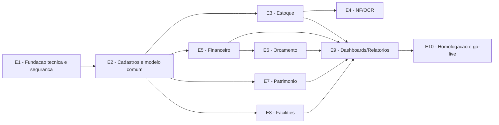

# Roadmap Macro - Piloto 3A RIVA

Este e o artefato do Portao 2 do framework SDD aplicado ao piloto de reconstrucao do Sistema Administrativo 3A RIVA. Ele organiza a ordem estrategica das etapas antes do Design Tecnico e do Roadmap Detalhado.

Regra de altitude aplicada: este roadmap decide ordem, dependencias, paralelizacao e revisoes humanas. Ele nao define schema final, endpoints, componentes, criterios por subetapa ou testes travados.

## 1. Metadados E Status

| Campo | Valor |
| --- | --- |
| Projeto | Reconstrucao do Sistema Administrativo 3A RIVA (piloto SDD) |
| Escopo | `global` |
| Area solicitante | Administrativo 3A RIVA, com apoio de TI/Seguranca |
| Responsavel pelo roadmap | PENDENTE - responsavel tecnico do piloto |
| Status | `Rascunho` |
| Versao | `v0.2` |
| Data | 2026-06-16 |
| Baseado na Matriz Tecnica | `system_refactor/outputs/1-matriz-tecnica-piloto-3a-riva.md` v0.4 |
| Artefato anterior | Matriz Tecnica |
| Artefato seguinte | Design Tecnico |

## 2. Visao Geral

A execucao deve comecar por uma fundacao segura: app Next.js, autenticacao Firebase com Google SSO, usuario interno pendente/ativo, autorizacao server-side, banco Postgres via Prisma, auditoria e Storage privado. Sem essa base, os modulos operacionais podem parecer prontos visualmente, mas nasceriam com os mesmos riscos do legado.

Depois da fundacao, entram os cadastros compartilhados e os modulos P1: Estoque, NF/OCR, Financeiro e Orcamento. Esses modulos concentram os maiores riscos de integridade, arquivos, valores e rastreabilidade fisico-financeira.

Por fim entram Patrimonio, Facilities, Dashboards/Relatorios e hardening de homologacao. Essas etapas dependem da fundacao e dos catalogos, mas parte delas pode rodar em paralelo depois que os padroes tecnicos estiverem travados.

Observacao de stack: a matriz v0.4 decide Supabase Postgres como banco gerenciado da v1. Railway Postgres deve ficar registrado apenas como alternativa avaliada/descartada no ADR de banco.

## 3. Etapas Macro

| ID | Etapa | Objetivo | Entregavel principal | Cobre (matriz: modulo/req) | Depende de | Design tecnico necessario? | Portao | Status |
| --- | --- | --- | --- | --- | --- | --- | --- | --- |
| E1 | Fundacao tecnica e seguranca base | Criar base do app, banco, auth, usuario interno, autorizacao server-side, auditoria e padroes de erro | App base seguro e padroes transversais | Sec. 5, 6, 7, 8, 9, 14, 18 | Matriz validada | sim | HUMANO | Pendente |
| E2 | Cadastros estruturais e modelo comum | Definir e implementar entidades compartilhadas como filial, departamento, fornecedor, categorias, arquivos e auditoria | Catalogos compartilhados e modelo comum | Sec. 9, 11, 12, 13 | E1 | sim | HUMANO | Pendente |
| E3 | Estoque | Implementar produtos, colaboradores, movimentacoes, saldo e indicadores operacionais | Modulo Estoque funcional | Sec. 9, 10, 11, Fluxo 3, RN-006/RN-007 | E1, E2 | sim | HUMANO | Pendente |
| E4 | NF/OCR | Implementar upload privado, processamento, revisao, aprovacao e geracao de entrada de estoque | Fluxo NF/OCR revisavel e auditavel | Sec. 6, 9, 10, 11, Fluxo 2, RN-008/RN-010 | E1, E2, E3 parcial | sim | HUMANO | Pendente |
| E5 | Financeiro | Implementar despesas, solicitacoes, anexos, status, pagamentos e relatorios base | Modulo Financeiro funcional | Sec. 9, 10, 11, Fluxo 4, RN-015/RN-016 | E1, E2 | sim | HUMANO | Pendente |
| E6 | Orcamento operacional | Implementar orcamento por filial/macrobloco/categoria, realizado x orcado e recorrencias financeiras | Controle orcamentario funcional | Sec. 9, 11, Fluxo 4, RN-016/RN-019 | E2, E5 | sim | HUMANO | Pendente |
| E7 | Inventario patrimonial | Implementar cadastro, localizacao, fotos privadas, status e historico de patrimonio | Modulo Patrimonio funcional | Sec. 9, 10, 11, RN-013/RN-014 | E1, E2 | sim | HUMANO | Pendente |
| E8 | Facilities | Implementar tarefas, kanban, calendario, recorrencias e desempenho | Modulo Facilities funcional | Sec. 9, 10, 11, Fluxo 5, RN-020/RN-022 | E1, E2 | sim | HUMANO | Pendente |
| E9 | Dashboards, relatorios e exportacoes | Consolidar indicadores por modulo e exportacao financeira em Excel | Visao executiva e relatorios | Sec. 8, 9, RNF-015/RNF-020 | E3, E5, E6, E7, E8 | parcial | HUMANO | Pendente |
| E10 | Homologacao, hardening e go-live controlado | Fechar seguranca, smoke tests, validacao visual, treinamento e pendencias de operacao | Release candidata para piloto | Sec. 19, 20, 21 | E1-E9 | parcial | HUMANO | Pendente |

## 4. Mapa De Dependencias

## 5. Paralelizacao

| Grupo | Etapas | Pode rodar em paralelo? | Condicao | Observacoes |
| --- | --- | --- | --- | --- |
| Fundacao | E1 | nao | Deve fechar antes dos modulos | Evita agentes implementarem CRUD sem guard server-side |
| Modelo comum | E2 | parcial | Pode preparar catalogos em paralelo com refinamento de UI | Depende da decisao final do provedor Postgres |
| Operacao P1 | E3, E5 | sim | Apos E1/E2 e padroes de autorizacao | Estoque e Financeiro compartilham fornecedor/categoria, mas podem evoluir por trilhas separadas |
| NF e Orcamento | E4, E6 | parcial | NF depende de Estoque; Orcamento depende de Financeiro | Podem rodar em paralelo depois das bases dos modulos origem |
| Operacao P2 | E7, E8 | sim | Apos E1/E2 | Patrimonio e Facilities podem ser delegados a agentes distintos |
| Consolidacao | E9, E10 | nao | Requer dados reais dos modulos | Dashboards e homologacao dependem da integridade dos modulos |

## 6. Designs Tecnicos Necessarios

| Design tecnico | Etapas cobertas | Por que e necessario | Prioridade |
| --- | --- | --- | --- |
| `3-design-tecnico-piloto-3a-riva.md` | E1-E10 | Design tecnico global suficiente para gerar roadmap detalhado por agentes | P0 |
| ADR de stack e banco gerenciado | E1, E2 | Formalizar Supabase Postgres, pooler recomendado e Railway como alternativa descartada | P0 |
| ADR de auth/autorizacao | E1 | Formalizar Firebase Google SSO proprio do app em iframe, usuario interno e backend authorization em vez de RLS | P0 |
| ADR de storage privado | E1, E4, E5, E7, E8 | Garantir arquivos privados por padrao e sem URL publica permanente | P0 |
| ADR de OCR/IA | E4 | Escolher provider, limites, seguranca e formato de resposta | P1 |

## 7. Marcos De Revisao Humana

| Marco | Quando ocorre | Quem valida | Motivo |
| --- | --- | --- | --- |
| Portao 1 - Matriz | Antes de iniciar Design Tecnico | Negocio + tecnico | Confirmar escopo, modulos e decisoes base |
| Decisao banco gerenciado | Antes de migrations reais | Tecnico/TI | Supabase Postgres decidido; validar pooler recomendado e connection string |
| Confirmacao SSO em iframe | Antes de E1.S3 | Tecnico/TI | Reproduzir padrao Bob: Firebase Auth + Google popup + frame-ancestors no dominio final |
| Fundacao segura | Ao concluir E1 | Tecnico/TI | Auth, autorizacao, segredos e banco exigem revisao humana |
| NF/OCR | Antes de liberar E4 | Negocio/Estoque + tecnico | Fluxo sensivel com arquivo, IA, estoque e financeiro |
| Financeiro/Orcamento | Antes de liberar E5/E6 | Financeiro/Controladoria + tecnico | Valores, status e realizado x orcado precisam bater |
| Go-live | Ao concluir E10 | Negocio + tecnico | Aceite final do piloto e plano de operacao |

## 8. Riscos Do Roadmap

| Risco | Impacto | Mitigacao | Afeta quais etapas |
| --- | --- | --- | --- |
| Pooler/conexao Postgres mal configurados | Esgotamento de conexoes ou falha em serverless | Usar pooler recomendado do Supabase e registrar no ADR P0 | E1, E2 |
| Agentes criarem acesso direto sem guard | Quebra de seguranca | Design tecnico deve exigir helpers server-side e testes de autorizacao | E1-E10 |
| Prints pendentes de Auth/Admin e NF/OCR | Validacao visual incompleta | Seguir por fluxo textual e bloquear validacao visual final ate receber prints | E1, E4 |
| Catalogo RN/RF/RNF ainda preliminar | Requisito pode ser perdido na execucao detalhada | Revisar catalogo antes do Roadmap Detalhado final | E10, Portao 4 |
| Provider OCR indefinido | Atraso ou mudanca de contrato | Isolar provider atras de interface e mock inicial | E4 |
| Categorias/filiais reais nao confirmadas | Dados de homologacao incorretos | Usar seed temporario e marcar pendencia de negocio | E2, E5, E6 |
| Escopo crescer durante execucao | Atraso no piloto | Usar fora de escopo e registrar mudancas em nova versao | Todas |

## 9. Criterios De Aceite Do Roadmap Macro - Portao 2

- [ ] A matriz tecnica usada como base esta validada ou aprovada para orientar o Roadmap Macro.
- [ ] As etapas macro cobrem o escopo da matriz.
- [ ] As etapas nao incluem detalhe de implementacao que pertence ao Design Tecnico.
- [ ] Dependencias entre etapas estao claras.
- [ ] Paralelizacao possivel esta identificada.
- [ ] Etapas sensiveis possuem portao humano.
- [ ] Designs tecnicos necessarios foram identificados.
- [ ] Riscos de execucao foram registrados.
- [ ] Marcos de revisao humana estao claros.
- [ ] Validado por responsavel tecnico em `AAAA-MM-DD`.

## 10. Pendencias Para Design Tecnico

| Pendencia | Por que importa | Bloqueia design tecnico? | Responsavel |
| --- | --- | --- | --- |
| Validacao final de connection string/pooler Supabase | Impacta Prisma, CI, migrations e producao | nao para rascunho; sim antes de implementacao | TI/Responsavel tecnico |
| Reproduzir padrao Bob de login em iframe | Confirma Google popup, persistencia e dominios no ambiente final | nao para rascunho; sim antes de E1.S3 | TI/Responsavel tecnico |
| Confirmar dominio Google corporativo permitido | Impacta regra de login SSO | nao | TI |
| Prints de Auth/Admin e NF/OCR | Impacta validacao visual e copy de fluxo | nao | Negocio/TI |
| Provider de OCR/IA | Impacta contrato tecnico do modulo NF/OCR | nao para design global; sim para implementacao real | TI |
| Politica de retencao de arquivos/logs | Impacta storage, auditoria e LGPD | nao para rascunho; sim antes do go-live | TI/DPO |
| Revisao manual RN/RF/RNF | Necessaria para travar subetapas e testes sem erro de conversao | sim antes do Roadmap Detalhado validado | Negocio/TI |

## 11. Historico De Alteracoes

| Versao | Data | Autor | Mudanca | Status resultante |
| --- | --- | --- | --- | --- |
| `v0.1` | 2026-06-16 | Equipe SDD 3A RIVA | Criacao inicial do Roadmap Macro a partir da Matriz Tecnica v0.3 | `Rascunho` |
| `v0.2` | 2026-06-16 | Equipe SDD 3A RIVA | Consolida decisoes da matriz v0.4: Supabase Postgres decidido, Railway como alternativa descartada, Google SSO proprio do app em iframe, pooler Supabase e confirmacao do padrao Bob antes do auth | `Rascunho` |
