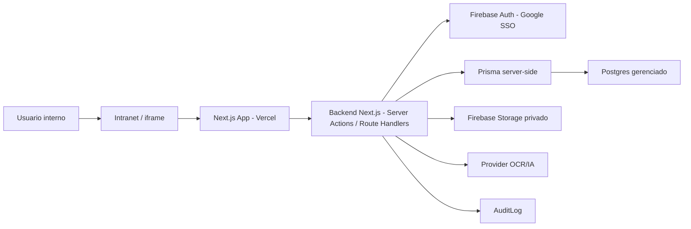
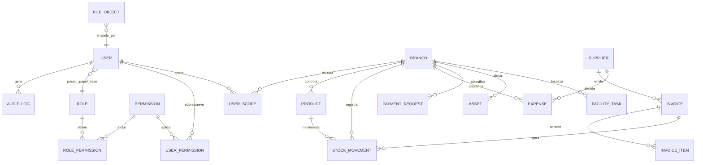

# Especificacao Tecnica / Design Tecnico - Piloto 3A RIVA

Este e o artefato do Portao 3 do framework SDD aplicado ao piloto de reconstrucao do Sistema Administrativo 3A RIVA. Ele traduz a Matriz Tecnica v0.4 e o Roadmap Macro v0.2 em desenho tecnico suficiente para gerar um Roadmap Detalhado executavel por agentes.

Regra de escopo: este documento define como o sistema deve ser desenhado tecnicamente. Ele nao define tarefas finais de execucao nem substitui PRDs de subetapa.

## 1. Metadados E Status

| Campo | Valor |
| --- | --- |
| Projeto | Reconstrucao do Sistema Administrativo 3A RIVA (piloto SDD) |
| Escopo | `global` |
| Area solicitante | Administrativo 3A RIVA, com apoio de TI/Seguranca |
| Responsavel tecnico | PENDENTE |
| Status | `Rascunho` |
| Versao | `v0.2` |
| Data | 2026-06-16 |
| Baseado na Matriz | `system_refactor/outputs/1-matriz-tecnica-piloto-3a-riva.md` v0.4 |
| Baseado no Roadmap Macro | `system_refactor/outputs/2-roadmap-macro-piloto-3a-riva.md` v0.2 |
| Artefato anterior | Roadmap Macro |
| Artefato seguinte | Roadmap Detalhado |

## 2. Resumo Tecnico

O sistema sera uma aplicacao Next.js + TypeScript, implantada na Vercel e exibida por iframe na intranet. A autenticacao sera feita via Firebase Auth com Google SSO proprio do app, replicando o padrao ja validado no app Bob: `signInWithPopup`, persistencia do Firebase Auth Web SDK no browser e liberacao por `frame-ancestors`. O backend validara o ID token Firebase em toda operacao sensivel, localizara o usuario interno no Postgres e aplicara status, papel, permissao e escopo antes de qualquer operacao. O banco da v1 sera Supabase Postgres acessado exclusivamente no servidor via Prisma e pooler recomendado.

Arquivos operacionais ficarao no Firebase Storage, privados por padrao, com metadados no banco em `FileObject`. O upload sera direto para Storage usando path gerado pelo backend; o `FileObject` nasce `pending_validation` e so fica utilizavel depois de validacao server-side. O frontend nao acessa tabelas operacionais diretamente, nao decide autorizacao e nao envia campos de autoria/status confiaveis. Toda regra sensivel passa por camada server-side, schema runtime, auditoria e erros seguros. Firebase Analytics fica fora da v1.

## 3. Decisoes Herdadas Da Matriz

| Decisao | Origem na matriz | Impacto tecnico | Observacoes |
| --- | --- | --- | --- |
| Next.js + TypeScript + Prisma + Supabase Postgres | Sec. 5, 18 | App full-stack com acesso a dados apenas server-side | Railway fica alternativa descartada em ADR |
| Firebase Auth com Google SSO proprio do app | Sec. 5, 7, 18 | Login unico inicial via popup no iframe; dominios corporativos obrigatorios | Login/senha fora da v1 inicial |
| Backend authorization em vez de RLS primario | Sec. 6, 7, 17, 18 | Criar helpers obrigatorios de authz antes de qualquer query | RLS por usuario final nao sera controle pratico neste desenho com Prisma/Firebase; evitar falsa camada de seguranca |
| Arquivos privados por padrao | Sec. 6, 10, 13, 14, 18 | Firebase Storage privado, path server-side, URL assinada curta/proxy | Sem URL publica permanente |
| Auditoria desde a fundacao | Sec. 8, 9, 11, 15, 18 | `AuditLog` transversal para acoes sensiveis | Logs tecnicos separados de auditoria de negocio |
| OCR/IA nao confiavel | Sec. 6, 10, 14, 15 | Provider isolado, saida validada por schema, sem confiar em texto extraido | Provider pendente |
| Iframe na intranet | Sec. 5, 6, 14, 18 | Configurar `frame-ancestors` restrito | Validar dominio final |

## 4. Arquitetura De Alto Nivel



### Componentes

| Componente | Responsabilidade | Tecnologia | Observacoes |
| --- | --- | --- | --- |
| App Web | UI, navegacao, formularios, estados e exibicao de dados autorizados | Next.js + React + TypeScript | Client nunca decide seguranca |
| Backend server-side | Validar auth, authz, input, transacoes, auditoria e erros | Next.js Route Handlers / Server Actions | Toda operacao sensivel passa por aqui |
| Auth externo | Provar identidade via Google SSO proprio do app | Firebase Auth | Usar popup/persistencia como app Bob; dominios corporativos obrigatorios |
| Usuario interno | Status, papel, permissao e escopo do usuario | Postgres + Prisma | `firebaseUid` vincula auth externa ao usuario interno |
| Banco | Dados relacionais, integridade e historicos | Supabase Postgres | Acesso apenas pelo servidor via Prisma e pooler recomendado |
| ORM | Schema, migrations e queries tipadas | Prisma | Usar transacoes para fluxos criticos |
| Storage | Arquivos privados de NF, comprovantes e fotos | Firebase Storage | Metadados em `FileObject` |
| Auditoria | Registrar acoes sensiveis | Postgres | Nao depender de `userId` vindo do client |
| OCR/IA | Extrair dados de NF | Provider a definir | Saida sempre validada |

### Fronteiras Tecnicas

| Fronteira | Dado que atravessa | Risco | Controle |
| --- | --- | --- | --- |
| Browser -> Backend | Forms, filtros, uploads, comandos | Payload forjado, mass assignment | Schema runtime e campos server-owned |
| Backend -> Firebase Auth | Token/sessao | Token invalido ou dominio indevido | Verificacao server-side e dominio permitido |
| Backend -> Postgres | Queries e mutations | Acesso sem escopo | Guard obrigatorio antes do Prisma |
| Backend -> Storage | Arquivos e paths | Arquivo publico ou path previsivel | Path server-side, storage privado, URL curta |
| Backend -> OCR/IA | PDF/imagem e texto extraido | Prompt injection e vazamento de chave | Segredo em env, schema de saida, logs sem conteudo sensivel |
| Vercel -> iframe | UI embutida | Clickjacking/embed indevido | `frame-ancestors` restrito |

## 5. Modelo De Dados

### Entidades

| Entidade | Descricao | Dado pessoal? | Observacoes |
| --- | --- | --- | --- |
| User | Usuario interno vinculado ao Firebase UID | sim | Status `pending/inactive/active`; papel e permissoes |
| Role | Papel base (`admin`, `moderator`, `user`) | nao | Pacote base de permissoes |
| RolePermission | Permissoes padrao de um papel | nao | Define o baseline de acesso por papel |
| Permission | Permissao granular por modulo/acao | nao | Catalogo de permissoes |
| UserPermission | Override de permissao por usuario | nao | Excecoes/adicoes/remocoes em relacao ao papel |
| UserScope / UserBranch | Escopos/filiais de operacao do usuario | nao | Suporta multi-filial e escopo global |
| Branch | Filial/unidade/centro de custo | nao | Base de escopo |
| Department | Area/departamento | nao | Apoia colaboradores e usuarios |
| Supplier | Fornecedor compartilhado | possivel | Pode conter contato PF |
| FileObject | Metadados de arquivo privado | possivel | Conteudo pode ser confidencial |
| Product | Produto de estoque | nao | Saldo nao editavel manualmente |
| StockMovement | Entrada, saida ou ajuste | possivel | Pode vincular colaborador responsavel |
| Collaborator | Colaborador/beneficiario | sim | Referenciado por ID |
| Invoice / InvoiceItem | NF e itens revisados | possivel | Saida OCR nasce pendente/revisao |
| Expense | Despesa financeira | possivel | Valores em decimal |
| PaymentRequest | Solicitacao de pagamento | possivel | Status controlado no backend |
| OperationalBudget | Orcamento por ano/mes/filial/macrobloco/categoria | nao | Chave unica logica |
| RecurringExpense | Recorrencia financeira | possivel | Execucao idempotente |
| Asset | Bem patrimonial | possivel | Codigo gerado no servidor |
| FacilityTask | Tarefa/manutencao | possivel | Status e recorrencia |
| AuditLog | Evento auditavel | sim | Ator, entidade, acao e contexto |

### Relacionamentos



| Relacionamento | Cardinalidade | Regra | Obrigatorio? |
| --- | --- | --- | --- |
| User -> AuditLog | 1:N | Toda acao sensivel deve registrar ator | sim para acoes sensiveis |
| Branch -> entidades operacionais | 1:N | Escopo por filial quando aplicavel | sim |
| Supplier -> Invoice/Expense | 1:N | Fornecedor unico entre NF/Financeiro | sim quando houver fornecedor |
| Invoice -> InvoiceItem | 1:N | NF sem itens nao pode ser aprovada | sim |
| Invoice aprovada -> StockMovement | 1:N | Aprovacao gera entradas transacionais | sim para NF com produtos |
| Product -> StockMovement | 1:N | Saldo deriva de movimentos | sim |
| FileObject -> anexaveis | N:1 logico | Arquivos referenciam entidade de negocio | sim para anexos |

### Constraints E Integridade

| Entidade | Constraint | Motivo | Como validar |
| --- | --- | --- | --- |
| User | `firebaseUid` unique; status enum | Evitar duplicidade e usuario fantasma | Teste de login e liberacao |
| Permission | unique por codigo `module:action` | Evitar permissoes duplicadas | Teste de RBAC |
| RolePermission | unique por role + permission | Evitar pacote duplicado | Teste de RBAC |
| UserPermission | unique por user + permission + efeito | Evitar override duplicado | Teste de RBAC |
| UserScope / UserBranch | unique por user + branch; escopo global controlado | Suporte multi-filial e admin global | Teste de escopo |
| Branch | identificador/codigo unico | Escopo confiavel | Seed/teste |
| Product | unidade/categoria obrigatoria; saldo nao editavel direto | Integridade de estoque | Teste de movimentacao |
| StockMovement | quantidade positiva; tipo enum; FK produto/filial | Saldo consistente | Teste transacional |
| Invoice | status enum; total decimal; fornecedor opcional/obrigatorio conforme regra | Revisao antes de aprovar | Teste NF/OCR |
| Expense/PaymentRequest | valor decimal positivo; status enum | Evitar status/valor forjado | Teste financeiro |
| OperationalBudget | unique ano/mes/filial/macrobloco/categoria | Evitar duplicidade orcamentaria | Teste de constraint |
| Asset | codigo patrimonial unique por regra definida | Evitar colisao | Teste de cadastro |
| FacilityTask | status enum; recorrencia idempotente | Evitar duplicidade | Teste de recorrencia |
| FileObject | owner/uploader, path unico, visibility private | Evitar URL solta | Teste storage |
| AuditLog | actorId, entityType, entityId, action, timestamp | Rastreabilidade minima | Teste de auditoria |

## 6. Schema Preliminar

```prisma
// Schema conceitual, nao final. Ajustar nomes, enums e indices no schema real.
model User {
  id          String   @id @default(cuid())
  firebaseUid String  @unique
  email       String  @unique
  name        String?
  status      UserStatus @default(PENDING)
  roleId      String?
  isGlobalScope Boolean @default(false)
  createdAt   DateTime @default(now())
  updatedAt   DateTime @updatedAt
}

model Role {
  id        String   @id @default(cuid())
  code      String   @unique
  name      String
  createdAt DateTime @default(now())
}

model Permission {
  id          String   @id @default(cuid())
  code        String   @unique // ex.: "stock:read"
  module      String
  action      String
  description String?
}

model RolePermission {
  id           String @id @default(cuid())
  roleId       String
  permissionId String
  @@unique([roleId, permissionId])
}

model UserPermission {
  id           String @id @default(cuid())
  userId       String
  permissionId String
  effect       PermissionEffect @default(ALLOW)
  @@unique([userId, permissionId, effect])
}

model UserScope {
  id       String @id @default(cuid())
  userId   String
  branchId String
  @@unique([userId, branchId])
}

model FileObject {
  id          String   @id @default(cuid())
  bucket      String
  path        String   @unique
  originalName String
  contentType String
  sizeBytes   Int
  visibility  FileVisibility @default(PRIVATE)
  uploadedById String
  entityType  String?
  entityId    String?
  createdAt   DateTime @default(now())
}

model AuditLog {
  id          String   @id @default(cuid())
  actorId     String?
  action      String
  entityType  String
  entityId    String?
  metadata    Json?
  requestId   String?
  createdAt   DateTime @default(now())
}

enum UserStatus {
  PENDING
  INACTIVE
  ACTIVE
}

enum PermissionEffect {
  ALLOW
  DENY
}

enum FileVisibility {
  PRIVATE
}
```

Observacoes:

- O schema final deve ser gerado por subetapas e migrations revisadas.
- Dados monetarios e quantidades devem usar decimal/numeric, nao float.
- JSON bruto de OCR nao deve crescer sem criterio; persistir apenas o necessario para auditoria e revisao.
- Supabase Postgres deve usar pooler recomendado para execucao em Vercel/serverless; migrations devem usar a connection string apropriada para migracao.
- A permissao efetiva deve ser calculada por: pacote do Role + UserPermission ALLOW - UserPermission DENY, limitada por UserScope/UserBranch, exceto admin com `isGlobalScope`.

## 7. Modelo De Autorizacao Detalhado

### Papeis

| Papel | Descricao | Pode gerenciar permissoes? | Observacoes |
| --- | --- | --- | --- |
| admin | Administra usuarios, permissoes, configuracoes e dados sensiveis | sim | Nao pode excluir a propria conta |
| moderator | Opera e aprova modulos autorizados | nao | Permissoes especificas por modulo/acao |
| user | Acessa apenas telas/acoes liberadas | nao | Acesso minimo por padrao |

### Permissoes Granulares

| Permissao | Modulo | Acao | Escopo | Descricao |
| --- | --- | --- | --- | --- |
| `admin:users` | Admin | manage | global | Gerenciar usuarios/status |
| `admin:permissions` | Admin | manage | global | Gerenciar papeis/permissoes |
| `audit:read` | Auditoria | read | global | Consultar auditoria |
| `stock:read` | Estoque | read | filial | Ver produtos/saldos |
| `stock:write` | Estoque | create/update | filial | Cadastrar produtos/movimentacoes |
| `stock:adjust` | Estoque | approve | filial | Fazer ajustes de estoque |
| `nf:upload` | NF/OCR | create | filial | Enviar arquivo de NF |
| `nf:review` | NF/OCR | update | filial | Revisar dados extraidos |
| `nf:approve` | NF/OCR | approve | filial | Aprovar NF e gerar efeitos |
| `financial:read` | Financeiro | read | filial | Ver despesas/solicitacoes |
| `financial:write` | Financeiro | create/update | filial | Criar despesas/solicitacoes |
| `financial:approve` | Financeiro | approve | filial | Aprovar solicitacoes |
| `financial:pay` | Financeiro | pay | filial | Marcar como pago |
| `budget:read` | Orcamento | read | filial | Ver realizado x orcado |
| `budget:write` | Orcamento | create/update | filial | Criar/ajustar orcamento |
| `inventory:write` | Patrimonio | create/update | filial | Gerenciar bens |
| `facilities:write` | Facilities | create/update | filial | Gerenciar tarefas |
| `reports:export` | Relatorios | export | filial/global | Exportar relatorios |

### Regras De Autorizacao

Regra de resolucao:

- Role entrega o pacote base de permissoes.
- UserPermission `ALLOW` adiciona excecoes ao usuario.
- UserPermission `DENY` remove permissoes especificas do pacote base.
- UserScope/UserBranch limita as filiais em que a permissao pode operar.
- Admin administrativo pode ter `isGlobalScope=true`.
- O primeiro admin nasce por seed controlado com e-mail informado/allowlist em env, executado uma vez e auditado. Alteracao direta no banco e apenas procedimento emergencial, nao fluxo oficial.

| Operacao | Permissao exigida | Escopo | Condicoes extras |
| --- | --- | --- | --- |
| Login operacional | qualquer permissao efetiva | global/filial | Usuario interno deve existir e estar `ACTIVE` |
| Liberar usuario | `admin:users` | global | Admin nao pode remover a propria capacidade de administrar sem confirmacao |
| Ler modulo | `<module>:read` | filial/global | Filtros de filial no backend |
| Criar/editar registro | `<module>:write` | filial | Ignorar `createdBy`, `status` e campos server-owned vindos do client |
| Aprovar NF | `nf:approve` | filial | Todos os itens revisados; total validado |
| Ajustar estoque | `stock:adjust` | filial | Auditoria obrigatoria |
| Marcar pagamento | `financial:pay` | filial | Status transicional valido |
| Exportar relatorio | `reports:export` | filial/global | Auditoria se relatorio contiver dado sensivel |
| Ler arquivo | permissao do modulo dono | filial/proprio | Gerar URL assinada curta/proxy apos authz |

## 8. Contratos De API / Server Actions

| Endpoint/Action | Metodo | Auth | Permissao | Input | Output | Erros |
| --- | --- | --- | --- | --- | --- | --- |
| `getCurrentUserContext` | server | sim | usuario ativo | token/sessao | usuario, permissoes, escopos | `UNAUTHORIZED`, `USER_PENDING` |
| `admin.updateUserStatus` | action | sim | `admin:users` | userId, status | usuario atualizado | `FORBIDDEN`, `INVALID_STATUS` |
| `files.createUploadIntent` | action/route | sim | permissao do modulo | tipo, tamanho, entidade alvo | path + `FileObject pending_validation` | `INVALID_FILE`, `FORBIDDEN`, `RATE_LIMITED` |
| `files.validateUploadedFile` | action/job | sim/backend | permissao do modulo dono | fileId | `FileObject usable/rejected` | `INVALID_FILE`, `NOT_FOUND` |
| `files.getSignedReadUrl` | action/route | sim | permissao do modulo dono | fileId utilizavel | url curta | `NOT_FOUND`, `FORBIDDEN`, `FILE_NOT_VALIDATED` |
| `stock.createMovement` | action | sim | `stock:write`/`stock:adjust` | produto, tipo, quantidade, filial | movimento/saldo | `INVALID_INPUT`, `INSUFFICIENT_STOCK` |
| `nf.processUpload` | route/action | sim | `nf:upload` | fileId | invoice em revisao | `OCR_FAILED`, `INVALID_FILE` |
| `nf.approveInvoice` | action | sim | `nf:approve` | invoiceId, ajustes revisados | NF aprovada + movimentos | `INVALID_STATE`, `TOTAL_MISMATCH` |
| `financial.createExpense` | action | sim | `financial:write` | fornecedor, valor, categoria, datas | despesa | `INVALID_AMOUNT`, `FORBIDDEN` |
| `financial.markPaid` | action | sim | `financial:pay` | id, data pagamento | status atualizado | `INVALID_TRANSITION` |
| `budget.upsertBudget` | action | sim | `budget:write` | ano/mes/filial/macrobloco/categoria/valor | orcamento | `DUPLICATE_BUDGET` |
| `reports.exportFinancial` | route | sim | `reports:export` | filtros | arquivo Excel | `FORBIDDEN`, `TOO_LARGE` |

Padrao obrigatorio para toda operacao sensivel: validar input, validar token, buscar usuario interno, bloquear usuario pendente/inativo, validar permissao, validar escopo, executar com Prisma, auditar quando aplicavel e retornar erro seguro.

## 9. Validacoes De Dominio

| Dominio | Regra | Onde validar | Erro esperado |
| --- | --- | --- | --- |
| Auth | Apenas Google SSO proprio do app; dominios corporativos obrigatorios | Firebase/backend | `UNAUTHORIZED_DOMAIN` |
| Usuario | Novo usuario nasce `PENDING`; pendente nao opera | backend | `USER_PENDING` |
| Estoque | Saida nao pode deixar saldo negativo sem regra explicita | backend/db | `INSUFFICIENT_STOCK` |
| NF/OCR | Total calculado deve bater com total declarado ou exigir revisao | backend | `TOTAL_MISMATCH` |
| Financeiro | Valor monetario positivo e status transicional valido | backend/db | `INVALID_AMOUNT`, `INVALID_TRANSITION` |
| Orcamento | Chave ano/mes/filial/macrobloco/categoria unica | db/backend | `DUPLICATE_BUDGET` |
| Patrimonio | Codigo patrimonial gerado no servidor | backend/db | `DUPLICATE_ASSET_CODE` |
| Facilities | Recorrencia idempotente | backend/db | `DUPLICATE_RECURRENCE_RUN` |
| Arquivos | Tipo, tamanho e assinatura real validados apos upload | backend | `INVALID_FILE` |
| Rate limit | Upload/OCR limitados por usuario e janela temporal | backend/db | `RATE_LIMITED` |

## 10. Storage E Arquivos

| Tipo de arquivo | Path/organizacao | Quem pode enviar | Quem pode ler | Retencao | Observacoes |
| --- | --- | --- | --- | --- | --- |
| NF | `nf/{branchId}/{invoiceId}/{fileId}` | `nf:upload` | `nf:read/review/approve` | PENDENTE | PDF/imagem privado |
| Comprovante financeiro | `financial/{branchId}/{entityId}/{fileId}` | `financial:write` | financeiro autorizado | PENDENTE | Pode conter dado bancario |
| Foto patrimonio | `inventory/{branchId}/{assetId}/{fileId}` | `inventory:write` | patrimonio autorizado | PENDENTE | Evitar URL publica |
| Anexo facilities | `facilities/{branchId}/{taskId}/{fileId}` | `facilities:write` | facilities autorizado | PENDENTE | Privado por padrao |
| Exportacao temporaria | `exports/{userId}/{requestId}` | backend | solicitante autorizado | curta | Gerar e expirar |

Controles obrigatorios:

- arquivo privado por padrao;
- Storage Rules devem negar acesso direto de client a arquivos operacionais, exceto excecao explicitamente aprovada;
- path gerado pelo servidor;
- upload direto para Firebase Storage com `FileObject` em `pending_validation`;
- tipo, tamanho e assinatura real validados apos upload e antes do arquivo ser utilizavel;
- metadados persistidos em `FileObject`;
- leitura via URL assinada curta ou proxy autorizado;
- auditoria para upload, leitura sensivel, remocao e exportacao.
- rate limit simples por banco para upload/OCR na v1.

## 11. Auditoria E Logs

| Acao | Entidade | Evento de auditoria | Campos minimos |
| --- | --- | --- | --- |
| Liberar/inativar usuario | User | `user.status_changed` | actorId, targetUserId, before/after, requestId |
| Alterar permissoes | Permission | `permission.changed` | actorId, user/role, before/after |
| Upload arquivo | FileObject | `file.uploaded` | actorId, fileId, entity, size, contentType |
| Ler arquivo sensivel | FileObject | `file.read_url_issued` | actorId, fileId, entity, expiresAt |
| Aprovar NF | Invoice | `invoice.approved` | actorId, invoiceId, totals, movements |
| Ajustar estoque | StockMovement | `stock.adjusted` | actorId, productId, qty, reason |
| Marcar pagamento | PaymentRequest/Expense | `financial.paid` | actorId, entityId, amount, paidAt |
| Alterar orcamento | OperationalBudget | `budget.changed` | actorId, key, before/after |
| Baixar patrimonio | Asset | `asset.retired` | actorId, assetId, reason |
| Alterar status facilities | FacilityTask | `facility.status_changed` | actorId, taskId, before/after |

Logs tecnicos devem usar `requestId`, ambiente, rota/action, erro interno seguro e sem tokens, credenciais, arquivo completo ou dado bancario.

## 12. Tratamento De Erros

| Cenario | Mensagem ao usuario | Log interno | Status/codigo |
| --- | --- | --- | --- |
| Sem login | Sessao invalida ou expirada. Entre novamente. | auth token ausente/invalido | `UNAUTHORIZED` |
| Usuario pendente | Seu acesso ainda esta pendente de liberacao. | user status pending | `USER_PENDING` |
| Sem permissao | Voce nao tem permissao para esta acao. | permission/scope denied | `FORBIDDEN` |
| Recurso inexistente ou fora de escopo | Registro nao encontrado. | resource out of scope/not found | `NOT_FOUND` |
| Upload invalido | Arquivo invalido ou fora do limite permitido. | mime/size/signature failed | `INVALID_FILE` |
| OCR falhou | Nao foi possivel processar a NF. Envie para revisao ou tente novamente. | provider error with requestId | `OCR_FAILED` |
| Erro interno | Ocorreu um erro interno. Tente novamente. | stack/context sanitized | `INTERNAL_ERROR` |

## 13. Regras De UI Tecnica

| Area | Padrao | Observacoes |
| --- | --- | --- |
| Estados | loading, vazio, erro, sem permissao | Toda tela operacional deve prever estados |
| Acoes destrutivas | AlertDialog customizado | Proibido `alert`/`confirm` nativo |
| Formularios | Validacao client-side e server-side | Client melhora UX, server decide |
| Dados financeiros | Formatacao BRL e decimal correto | Nao usar float |
| Quantidades | KG com 3 casas; demais unidades 2 casas | Conforme matriz |
| Permissoes visuais | Ocultar/desabilitar acoes sem permissao | Apenas UX; backend valida |
| Iframe | Layout responsivo e sem dependencia de janela externa | Validar no dominio final |

## 14. Integracoes Tecnicas

| Integracao | Fluxo | Credencial | Ambiente | Risco | Controle |
| --- | --- | --- | --- | --- | --- |
| Firebase Auth | Google SSO e validacao server-side | env/config + Admin SDK | dev/hml/prod | Token aceito sem usuario interno | Validar token + usuario ativo |
| Firebase Storage | Upload/leitura de arquivos privados | service account/env | dev/hml/prod | URL publica ou path exposto | Storage privado + URL curta |
| Supabase Postgres | Dados relacionais | `DATABASE_URL` + connection string de migration | dev/hml/prod | Segredo exposto/conexao ruim | Env segura + pooler recomendado |
| OCR/IA | Processar NF | API key/env | hml/prod | Prompt injection/vazamento | Provider isolado + schema |
| Vercel | Deploy app | env vars | dev/hml/prod | Env incorreta | Checklist env |
| Intranet | Exibir app por iframe | dominio permitido | hml/prod | Embed indevido | `frame-ancestors` |
| Firebase Analytics | Fora da v1 | nenhuma | - | LGPD/cookies/iframe sem necessidade imediata | Reavaliar pos-go-live |

## 15. Testes Tecnicos Esperados

| Tipo | Arquivo/Suite | O que cobre | Obrigatorio para |
| --- | --- | --- | --- |
| Unit | `tests/unit/authz/*` | guards, permissoes, escopo | E1 |
| Unit | `tests/unit/domain/*` | regras de status, valores, transicoes | E3-E8 |
| Integration | `tests/integration/db/*` | constraints, transacoes, auditoria | E1-E8 |
| Integration | `tests/integration/storage/*` | upload privado, validacao pos-upload, URL assinada, metadados | E1, E4, E5, E7 |
| Integration | `tests/integration/nf/*` | processamento/revisao/aprovacao | E4 |
| E2E/Smoke | `tests/e2e/smoke.spec.ts` | login, navegacao, CRUD principal | E10 |
| Security | secret scan / dependency audit | segredos e dependencias | todos gates |
| Security | authz matrix tests | usuario sem permissao, pendente, filial errada | E1-E10 |
| Manual | roteiro homologacao negocio | fluxo operacional e visual | E10 |

Estrategia de execucao dos testes:

- Unit tests rodam sem servicos externos.
- Integration DB roda contra banco Postgres de teste isolado ou schema descartavel, nunca contra producao.
- Auth/Storage devem usar Firebase Emulator Suite quando viavel; se o emulador nao cobrir o fluxo de popup, o teste de popup vira smoke manual em homologacao.
- OCR deve ser mockado nos testes automaticos; provider real entra em homologacao controlada.
- Cada PRD/issue deve informar comandos, dados de teste e resultado esperado para que agente e usuario consigam reproduzir.

## 16. Gates Tecnicos

| Gate | Tipo | Quando aplica | Evidencia |
| --- | --- | --- | --- |
| Stack/banco aprovado | HUMANO | Antes de migrations reais | ADR aceito |
| Auth/autorizacao | HUMANO | E1 e toda mudanca de permissao | Testes authz + revisao tecnica |
| Storage privado | HUMANO | Antes de liberar upload/leitura | Testes storage + revisao regras |
| Financeiro/orcamento | HUMANO | E5/E6 | Testes valores/status + validacao negocio |
| NF/OCR | HUMANO | E4 | Testes OCR/revisao/aprovacao + validacao negocio |
| CI basico | AUTO | Toda PR | lint/typecheck/testes obrigatorios |
| Go-live | HUMANO | E10 | Smoke test + aceite negocio/tecnico |

## 17. ADRs E Decisoes Tecnicas

| Decisao | ADR | Status | Criticidade | Reversibilidade |
| --- | --- | --- | --- | --- |
| Stack Next.js + Firebase + Prisma + Postgres + Vercel | `outputs/adrs/ADR-001-stack.md` | proposto | alta | media |
| Provedor Postgres: Supabase Postgres | `outputs/adrs/ADR-002-postgres-provider.md` | proposto | alta | media |
| Backend authorization em vez de RLS primario | `outputs/adrs/ADR-003-authz-backend.md` | proposto | alta | media |
| Google SSO proprio do app em iframe | `outputs/adrs/ADR-004-google-sso.md` | proposto | alta | facil |
| Storage privado Firebase | `outputs/adrs/ADR-005-storage-privado.md` | proposto | alta | media |
| Provider OCR/IA | `outputs/adrs/ADR-006-ocr-provider.md` | pendente | media | media |

## 18. Riscos Tecnicos E Mitigacoes

| Risco | Impacto | Probabilidade | Mitigacao | Dono |
| --- | --- | --- | --- | --- |
| Pooler Supabase incorreto em serverless | Falhas de conexao ou esgotamento de conexoes | media | Usar pooler recomendado e documentar connection strings | Tecnico |
| Agente burlar guard e consultar Prisma direto | Vazamento/alteracao indevida | media | Lint/review + padrao repository/action com guard | Tecnico |
| OCR gerar dado errado | Entrada de estoque/financeiro incorreta | alta | Estado de revisao obrigatorio e validacao total | Negocio/TI |
| Arquivo publico acidental | Vazamento de NF/comprovante/foto | media | Storage privado por default e teste obrigatorio | Tecnico |
| JSON/log sensivel crescer no banco | Custo e LGPD | media | Minimizar persistencia e mascarar logs | Tecnico |
| Iframe bloquear login SSO | Atraso de auth | media | Testar popup/redirect e dominio final cedo | Tecnico |
| Testes obrigatorios sem ambiente reproduzivel | Gates vazios ou bloqueados | media | Definir emuladores/banco de teste e comandos por PRD | Tecnico |
| Relatorios divergirem de dados fonte | Perda de confianca | media | Indicadores derivados de queries revisadas | Tecnico/Negocio |

## 19. Pendencias Para Roadmap Detalhado

| Pendencia | Por que importa | Bloqueia roadmap detalhado? | Responsavel |
| --- | --- | --- | --- |
| Validar connection string/pooler Supabase | Evita rework operacional | sim para roadmap validado | TI/Tecnico |
| Revisar catalogo RN/RF/RNF | Trava requisitos e testes corretos | sim para roadmap validado | Negocio/TI |
| Confirmar dominio Google permitido | Define teste de login e regra SSO | nao | TI |
| Confirmar provider OCR/IA | Define contrato de NF/OCR | nao para rascunho; sim para implementacao E4 | TI |
| Receber prints Auth/Admin e NF/OCR | Fecha validacao visual | nao | Negocio |
| Politica de retencao | Define storage/logs | nao para rascunho; sim para go-live | TI/DPO |

## 20. Criterios De Aceite Do Design Tecnico - Portao 3

- [ ] Arquitetura e fronteiras tecnicas estao claras.
- [ ] Modelo de dados esta suficiente para iniciar schema/migrations.
- [ ] Regras de autorizacao granular estao definidas.
- [ ] Contratos de API/Server Actions estao definidos em nivel suficiente.
- [ ] Validacoes de dominio estao documentadas.
- [ ] Estrategia de storage e arquivos esta definida.
- [ ] Auditoria e logs estao definidos para acoes criticas.
- [ ] Tratamento de erros tem padrao seguro.
- [ ] Testes tecnicos esperados estao mapeados.
- [ ] Gates tecnicos e humanos estao definidos.
- [ ] ADRs necessarios foram criados ou listados.
- [ ] Pendencias nao bloqueiam indevidamente o roadmap detalhado.
- [ ] Validado por responsavel tecnico em `AAAA-MM-DD`.

## 21. Historico De Alteracoes

| Versao | Data | Autor | Mudanca | Status resultante |
| --- | --- | --- | --- | --- |
| `v0.1` | 2026-06-16 | Equipe SDD 3A RIVA | Criacao inicial do Design Tecnico global a partir da Matriz v0.3 e Roadmap Macro v0.1 | `Rascunho` |
| `v0.2` | 2026-06-16 | Equipe SDD 3A RIVA | Consolida decisoes tecnicas: Supabase Postgres decidido com pooler, Google SSO proprio do app em iframe, RBAC com Role/UserPermission/UserScope, multi-filial, primeiro admin por seed, upload direto com pending_validation, testes reproduziveis, Analytics fora da v1 e rate limit por banco | `Rascunho` |
