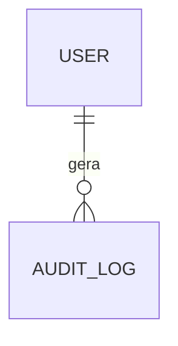

# Template - Matriz Tecnica De Alto Nivel

Este e o artefato do Portao 1 do framework SDD. Ele deve ser validado antes de qualquer roadmap detalhado, issue ou implementacao.

O objetivo deste documento e transformar inputs brutos em uma visao tecnica clara, revisavel por usuario de negocio com apoio tecnico, e capaz de orientar os artefatos seguintes.

Regra de altitude:

- a matriz registra decisoes estaveis, fronteiras, riscos, objetivos e criterios de direcao;
- detalhes que tendem a mudar durante implementacao devem ir para o design tecnico ou roadmap detalhado;
- se uma informacao provavelmente muda quando o codigo comeca, ela nao deve ser travada aqui.

Este template deve funcionar para:

- desenvolvimento novo;
- refatoracao;
- substituicao de sistema legado;
- automacao interna;
- produto para area externa;
- modulo isolado de um sistema maior.

## 1. Metadados E Status

| Campo | Valor |
| --- | --- |
| Projeto | `<nome do projeto>` |
| Area solicitante | `<area ou cliente interno>` |
| Responsavel pela validacao | `<nome>` |
| Escopo do documento | `<Global/Modulo/Feature/Subfeature>` |
| Status | `Rascunho` |
| Versao | `v0.1` |
| Data | `AAAA-MM-DD` |
| Stack-base prevista | `<stack>` |
| Artefato seguinte | `Roadmap macro` |

Status permitidos:

- `Rascunho`
- `Em revisao`
- `Validada - Portao 1`
- `Substituida`

## 2. Resumo Executivo, Objetivo, Escopo E Fora De Escopo

### Resumo Executivo

`<Resumo em 3 a 5 linhas, em linguagem de negocio, explicando o que sera feito, para quem, por que importa e qual resultado esperado.>`

### Objetivo

`<Descrever em 1 a 3 frases o que sera construido e qual problema resolve.>`

### No Escopo

- `<item>`
- `<item>`

### Fora Do Escopo

- `<item que nao sera feito agora>`
- `<item que deve ficar para evolucao futura>`

### Resultado Esperado

- `<ganho operacional, economico, tecnico, regulatorio ou de qualidade esperado>`

## 3. Inputs Usados

| Input | Caminho/Fonte | Status | Observacoes |
| --- | --- | --- | --- |
| Documento de requisitos | `<path ou link>` | `<lido/pendente>` | `<observacao>` |
| Prints/telas/referencias | `<path ou link>` | `<lido/pendente>` | `<observacao>` |
| Codigo legado | `<path ou repo>` | `<opcional>` | `<observacao>` |
| Auditoria de seguranca | `<path ou link>` | `<opcional>` | `<observacao>` |
| Entrevistas/regras verbais | `<fonte>` | `<pendente/validado>` | `<observacao>` |
| Restricoes de stack/custo/prazo | `<fonte>` | `<validado>` | `<observacao>` |

## 4. Motivacao Do Fazer Ou Refazer

### Contexto

`<Por que este projeto existe?>`

### Dor Atual

- `<dor operacional ou tecnica>`
- `<dor de seguranca, governanca ou escala, se houver>`

### Risco De Nao Fazer

- `<risco>`

### Motivacao Do Refazer, Se Aplicavel

`<Opcional. Usar apenas quando houver sistema legado ou versao anterior.>`

## 5. Stack E Restricoes

### Stack Proposta Ou Aprovada

- Frontend: `<ex.: Next.js + TypeScript>`
- Backend: `<ex.: Next.js Route Handlers / Server Actions>`
- Banco: `<ex.: PostgreSQL / Neon>`
- ORM: `<ex.: Prisma>`
- Auth: `<ex.: Firebase Auth>`
- Storage: `<ex.: Firebase Storage / GCS>`
- Deploy: `<ex.: Vercel>`
- Analytics/observabilidade: `<ex.: Firebase Analytics / logs estruturados>`

### Restricoes

- Prazo: `<restricao>`
- Custo: `<restricao>`
- Infraestrutura: `<restricao>`
- Compliance: `<restricao>`
- Integracao: `<restricao>`
- Compatibilidade: `<restricao>`

### Premissas

- `<premissa>`

## 6. Objetivo De Seguranca E Modelo De Ameacas

O sistema deve nascer seguro por desenho. Segurança nao deve ser tratada como etapa final de hardening.

Objetivos obrigatorios:

- negar acesso por padrao;
- autenticar todo usuario em recurso privado;
- autorizar no backend toda acao sensivel;
- validar input em toda entrada de dados;
- proteger segredos fora do client;
- proteger arquivos e documentos;
- registrar auditoria de acoes criticas;
- nao expor erro tecnico ao usuario final;
- minimizar dados pessoais;
- manter rastreabilidade de operacoes sensiveis.

### Atores E Abuse Cases

Esta secao descreve contra quais abusos o sistema precisa se defender. Os itens daqui devem virar criterios e testes travados no roadmap detalhado.

| Ator/Cenario | Tentativa de abuso | Controle esperado | Teste futuro |
| --- | --- | --- | --- |
| Usuario autenticado sem permissao | `<ex.: acessar dados de outro modulo>` | `<controle>` | `<teste esperado>` |
| Usuario de outra filial/escopo | `<ex.: acessar dados de outra filial>` | `<controle>` | `<teste esperado>` |
| Usuario malicioso ou conta comprometida | `<ex.: alterar status/valor sem permissao>` | `<controle>` | `<teste esperado>` |
| Agente/desenvolvedor | `<ex.: subir segredo no repo ou expor chave no client>` | `<controle>` | `<scan/teste>` |
| Upload/arquivo externo | `<ex.: arquivo invalido, payload grande, conteudo hostil>` | `<controle>` | `<teste>` |
| Integracao externa | `<ex.: callback ou iframe fora do dominio permitido>` | `<controle>` | `<teste>` |

## 7. Modelo De Autorizacao

### Autenticacao

`<Como a identidade do usuario sera provada.>`

### Autorizacao

`<Como o sistema decide o que o usuario pode fazer.>`

### Principios

- Usuario autenticado nao e automaticamente usuario autorizado.
- Middleware, layout protegido e guard visual nao sao suficientes como controle de seguranca.
- Toda Server Action, Route Handler, API ou funcao de dados deve validar autenticacao, autorizacao e input.
- Campos como `userId`, `role`, `status`, `createdBy` e `updatedBy` devem ser definidos ou verificados no servidor.
- Permissao deve considerar modulo, acao e escopo quando aplicavel.

### Modelo Conceitual De Acesso

| Area/Modulo | Tipo de acesso necessario | Escopo esperado | Observacoes |
| --- | --- | --- | --- |
| `<modulo>` | `<leitura/operacao/aprovacao/admin>` | `<global/filial/proprio>` | `<observacao>` |

Observacao: a lista granular de permissoes, como `module:action`, deve ficar no design tecnico ou roadmap detalhado. A matriz deve registrar o modelo e exemplos, nao a tabela final de RBAC.

## 8. Requisitos Nao Funcionais

| Categoria | Requisito | Como sera verificado | Prioridade |
| --- | --- | --- | --- |
| Seguranca | `<requisito>` | `<teste/revisao/scan>` | `<alta/media/baixa>` |
| Autorizacao | `<requisito>` | `<teste>` | `<alta>` |
| LGPD/privacidade | `<requisito>` | `<revisao>` | `<alta/media>` |
| Performance | `<requisito mensuravel>` | `<medicao>` | `<media>` |
| Observabilidade | `<logs/auditoria>` | `<teste/revisao>` | `<media>` |
| Usabilidade | `<requisito>` | `<homologacao>` | `<media>` |
| Compatibilidade | `<navegadores/dispositivos>` | `<teste>` | `<media>` |
| Custo/escala | `<limites esperados>` | `<monitoramento>` | `<media>` |

## 9. Modulos, Fronteiras E Dependencias

| Modulo | Objetivo | Telas/fluxos | Depende de | Pode rodar em paralelo com | Prioridade | Observacoes |
| --- | --- | --- | --- | --- | --- | --- |
| `<modulo>` | `<objetivo>` | `<referencias>` | `<dependencias>` | `<modulos>` | `<P0/P1/P2>` | `<observacao>` |

## 10. Achados Do Legado Opcional

Usar somente quando existir sistema anterior, codigo legado, planilhas, automacoes ou processo manual a substituir.

| Area | Achado | Impacto | Decisao Para O Novo Sistema |
| --- | --- | --- | --- |
| `<area>` | `<problema ou comportamento atual>` | `<impacto>` | `<como tratar>` |

## 11. Entidades Principais

| Entidade | Descricao | Modulos Relacionados | Observacoes |
| --- | --- | --- | --- |
| `<Entidade>` | `<descricao>` | `<modulos>` | `<observacao>` |

## 12. Relacionamentos Conceituais E Fronteiras De Dados

Use esta secao para registrar relacoes conceituais importantes e fronteiras de dados. Cardinalidades, FKs finais e regras detalhadas pertencem ao design tecnico.

| Relacao/Fronteira | Por que importa | Risco se mal desenhada | Observacoes |
| --- | --- | --- | --- |
| `<A se relaciona com B>` | `<motivo>` | `<risco>` | `<observacao>` |

## 13. LGPD Por Entidade

| Entidade | Dado pessoal? | Dado sensivel? | Base/justificativa | Retencao | Controle de acesso |
| --- | --- | --- | --- | --- | --- |
| `<Entidade>` | `<sim/nao>` | `<sim/nao>` | `<justificativa>` | `<prazo/politica>` | `<regra>` |

Pontos que exigem revisao humana:

- dados pessoais;
- dados bancarios;
- documentos;
- logs com informacao identificavel;
- acesso administrativo;
- exportacao de dados.

## 14. Integracoes

| Integracao | Protocolo | Dado Trafegado | Credencial | Risco | Controle |
| --- | --- | --- | --- | --- | --- |
| `<integracao>` | `<HTTPS/API/iframe/etc>` | `<dados>` | `<env/secret manager/nenhuma>` | `<risco>` | `<controle>` |

## 15. Fluxos Criticos

### Fluxo 1 - `<nome>`

1. `<passo>`
2. `<passo>`
3. `<passo>`

Controles obrigatorios:

- `<validacao>`
- `<auditoria>`
- `<permissao>`

## 16. Papeis E Permissoes

### Papeis

| Papel | Descricao | Observacoes |
| --- | --- | --- |
| `<papel>` | `<descricao>` | `<observacao>` |

### Regras De Acesso Em Alto Nivel

| Papel/Grupo | Pode acessar | Nao pode acessar | Observacoes |
| --- | --- | --- | --- |
| `<papel>` | `<modulos/acoes gerais>` | `<restricoes>` | `<observacao>` |

Observacao: permissoes granulares e nomes finais de claims/scopes devem ser definidos no design tecnico.

## 17. Rastreabilidade De Requisitos

Esta secao e condicional.

Use quando houver catalogo de requisitos numerados, como RN/RF/RNF. Se os inputs ainda forem brutos, primeiro gerar ou consolidar um catalogo de requisitos antes de preencher esta tabela.

| Requisito | Tipo | Descricao resumida | Cobertura na matriz | Status |
| --- | --- | --- | --- | --- |
| `<ID>` | `<RN/RF/RNF/outro>` | `<descricao>` | `<secao/modulo/fluxo>` | `<coberto/pendente>` |

## 18. Decisoes, Criticidade E ADRs

| Decisao | Criticidade | Reversibilidade | ADR | Status | Observacoes |
| --- | --- | --- | --- | --- | --- |
| `<decisao>` | `<alta/media/baixa>` | `<facil/media/dificil>` | `<path>` | `<proposto/aceito/rejeitado>` | `<observacao>` |

ADRs recomendados:

- escolha de stack;
- modelo de autenticacao/autorizacao;
- modelo de dados;
- estrategia de storage;
- estrategia de deploy;
- integracoes externas relevantes.

## 19. Criterios De Aceite Da Matriz - Portao 1

Antes de gerar roadmap, validar com duas assinaturas.

### Portao 1A - Validacao De Negocio

- [ ] Objetivo e escopo estao claros.
- [ ] Fora de escopo esta explicito.
- [ ] Inputs usados estao listados.
- [ ] Resumo executivo representa corretamente a necessidade da area.
- [ ] Modulos, fluxos e resultado esperado fazem sentido para a operacao.
- [ ] Insumos pendentes foram identificados e nao bloqueiam indevidamente o roadmap.
- [ ] Validada por `<responsavel de negocio>` em `AAAA-MM-DD`.

### Portao 1B - Validacao Tecnica

- [ ] Stack e restricoes estao documentadas.
- [ ] Modelo de seguranca cobre ameacas, auth, autorizacao, segredos, dados e arquivos.
- [ ] Requisitos nao funcionais sao mensuraveis.
- [ ] Entidades principais e relacionamentos conceituais estao claros o suficiente para iniciar design tecnico.
- [ ] Dados pessoais/sensiveis possuem controle de acesso e justificativa.
- [ ] Integracoes externas possuem risco e controle.
- [ ] Fluxos criticos possuem permissao, validacao e auditoria.
- [ ] Rastreabilidade de requisitos esta coberta ou marcada como condicional/pendente com justificativa.
- [ ] ADRs necessarios foram listados.
- [ ] Detalhes mutaveis foram deixados para design tecnico ou roadmap detalhado.
- [ ] Validada por `<responsavel tecnico>` em `AAAA-MM-DD`.

## 20. Insumos Pendentes

| Insumo | Por Que Importa | Bloqueia Roadmap? | Responsavel |
| --- | --- | --- | --- |
| `<insumo>` | `<motivo>` | `<sim/nao>` | `<responsavel>` |
