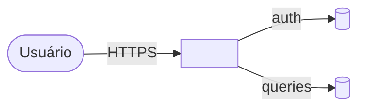

<!--
  TEMPLATE: Matriz Técnica de Alto Nível
  ───────────────────────────────────────
  Este é o artefato do PORTÃO 1 do framework: é o que VOCÊ valida "no olho"
  antes de qualquer linha de código ou roadmap.

  Princípio (herdado do skill define-architecture): nada genérico. Tudo
  ancorado na codebase real — cite arquivos, módulos e padrões que existem.

  Relação com ADRs: a matriz é a VISÃO CONSOLIDADA do módulo. Cada decisão
  de arquitetura individual continua morando em seu próprio ADR
  (docs/adr/NNNN-*.md). A matriz aponta para eles, não os duplica.

  Convenções usadas neste documento:
    🔒  trava — definido pelo responsável, não editável pelo delegado
    ⚠️  exige revisão humana antes de avançar
    <...> substitua pelo conteúdo
-->

# Matriz Técnica — <nome do módulo>

- **Status:** Rascunho <!-- Rascunho → Validada (Portão 1) → Substituída -->
- **Versão:** v0.1
- **Data:** AAAA-MM-DD
- **Responsável (valida o Portão 1):** <você>
- **Stack-base:** <ex.: Next.js 15 (App Router) / TypeScript / Firestore / Firebase Auth>

---

## 1. Objetivo e escopo

**Objetivo (1–2 frases):** <o que o módulo entrega e para quem>

**No escopo:**
- <item>

**Fora do escopo (explícito):**
- <item — o que conscientemente NÃO será feito agora; ancora YAGNI>

**Motivação do refazer:** <por que reconstruir do zero — resuma o problema de segurança da versão anterior; isto justifica o rigor dos portões adiante>

---

## 2. Requisitos não-funcionais (NFRs) 🔒

<!--
  Estes NFRs viram os critérios objetivos que os portões determinísticos do CI
  vão cobrar lá no roadmap detalhado. Seja específico e mensurável.
-->

| Categoria | Requisito | Como será verificado |
|-----------|-----------|----------------------|
| Segurança | <ex.: todo endpoint exige sessão autenticada> | <ex.: teste de integração + SAST> |
| Autorização | <ex.: RBAC por perfil; negação por padrão> | <teste de policy> |
| LGPD / privacidade | <ex.: dado pessoal só acessível ao titular e admin> | <teste + revisão humana> |
| Performance | <ex.: p95 < 300ms nas leituras> | <medição> |
| Escala / custo | <volume esperado> | <—> |
| Observabilidade | <logs estruturados, auditoria de ações sensíveis> | <—> |

---

## 3. Componentes e fronteiras

| Componente | Responsabilidade | Tecnologia | Arquivos/módulos (reais) |
|------------|------------------|------------|--------------------------|
| <ex.: API de admin> | <o que faz> | <Route Handlers> | `src/app/api/admin/...` |
| <ex.: Camada de dados> | <acesso a dados> | <Firestore> | `src/lib/firestore-service.ts` |

> 💡 Liste só as fronteiras que importam para a decisão. Cada fronteira é um ponto
> onde dado/permissão atravessa — e portanto candidato a teste de segurança.

---

## 4. Modelo de segurança ⭐ 🔒

<!--
  Esta é a seção mais importante: o módulo está sendo refeito por causa de segurança.
  É aqui que os critérios "travados" do roadmap nascem.
-->

- **Autenticação:** <quem é o usuário; como a identidade é provada>
- **Autorização:** <modelo de permissão — papéis, regra; princípio de negação por padrão>
- **Gestão de segredos:** <onde ficam; nunca no código; variáveis de ambiente / secret manager>
- **Superfície de ataque mapeada:** <endpoints, inputs, uploads, integrações>
- **Controles obrigatórios:** <validação de input, anti-IDOR, rate limit, auditoria, etc.>
- **⚠️ Pontos de revisão humana obrigatória:** <auth, mudança de permissão, acesso a dado pessoal>

---

## 5. Modelo de dados e LGPD

```mermaid
erDiagram
    <ENTIDADE_A> ||--o{ <ENTIDADE_B> : "<relação>"
```
<!-- Ajuste/troque o diagrama. Use erDiagram para dados, flowchart para componentes. -->

| Entidade | Dado pessoal? | Sensível? | Base legal | Retenção | Controle de acesso |
|----------|---------------|-----------|------------|----------|--------------------|
| <ex.: Usuário> | Sim | Não | <legítimo interesse / consentimento> | <prazo> | <regra> |

> ⚠️ Qualquer linha marcada como "dado pessoal/sensível" obriga validação do DPO/jurídico
> sobre a base legal antes de implementar a subetapa correspondente.

---

## 6. Integrações externas

| Integração | Protocolo | Dado que trafega | Credencial |
|------------|-----------|------------------|------------|
| <ex.: Zoom SDK> | <HTTPS/JWT> | <participantes> | <env var server-side> |

---

## 7. Diagrama de arquitetura (alto nível)


<!-- Legenda curta em prosa logo abaixo, explicando o que o diagrama mostra. -->

<Legenda: ...>

---

## 8. Decisões de arquitetura (ADRs vinculados)

| Decisão | ADR | Status |
|---------|-----|--------|
| <ex.: estratégia de autorização> | `docs/adr/00NN-...md` | Aceito |

> 💡 Decisões fechadas aqui devem virar ADRs via skill `define-architecture`.
> A matriz aponta; o ADR justifica em detalhe.

---

## 9. Restrições e premissas

- **Restrições:** <prazo, orçamento, stack imposta, compatibilidade>
- **Premissas:** <o que estamos assumindo; se cair, revisitar a matriz>

---

## 10. Critérios de aceite da matriz — PORTÃO 1 🔒

<!-- Você (responsável) marca isto "no olho" antes de liberar o roadmap. -->

- [ ] O objetivo e o escopo (in/out) estão inequívocos
- [ ] O modelo de segurança cobre auth, autorização e segredos
- [ ] Todo dado pessoal/sensível tem base legal e controle de acesso definidos
- [ ] Os NFRs são mensuráveis (dá para escrever teste/medição a partir deles)
- [ ] As decisões relevantes têm (ou terão) ADR vinculado
- [ ] **Validada por <você> em AAAA-MM-DD** → libera a geração do roadmap
