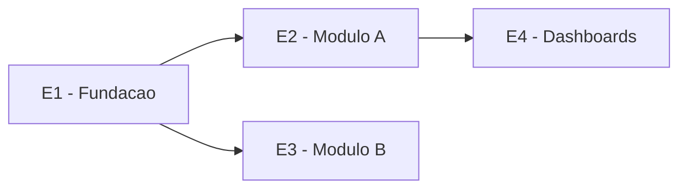

# Template - Roadmap Macro

Este e o artefato do Portao 2 do framework SDD. Ele vem depois da Matriz Tecnica validada e antes da Especificacao Tecnica / Design Tecnico.

Funcao deste documento:

- definir a ordem estrategica das etapas;
- explicitar dependencias;
- identificar o que pode rodar em paralelo;
- marcar revisoes humanas;
- indicar quais etapas exigem design tecnico antes do roadmap detalhado.

Este documento nao deve conter:

- subetapas executaveis;
- arquivos a alterar;
- schema detalhado;
- endpoints;
- criterios de aceite travados por subetapa;
- testes por subetapa.

## 1. Metadados E Status

| Campo | Valor |
| --- | --- |
| Projeto | `<nome do projeto>` |
| Escopo | `global` ou `modulo <X>` |
| Area solicitante | `<area ou cliente interno>` |
| Responsavel pelo roadmap | `<nome>` |
| Status | `Rascunho` |
| Versao | `v0.1` |
| Data | `AAAA-MM-DD` |
| Baseado na Matriz Tecnica | `<path + versao + data de validacao>` |
| Artefato anterior | `Matriz Tecnica` |
| Artefato seguinte | `Design Tecnico` |

Status permitidos:

- `Rascunho`
- `Em revisao`
- `Validado`
- `Substituido`

## 2. Visao Geral

`<Descrever em 3 a 6 linhas a estrategia de execucao. Explicar por que a ordem proposta faz sentido e quais fundamentos precisam vir antes das features.>`

Exemplo de raciocinio esperado:

- fundacao de auth antes de modulos operacionais;
- banco/modelo antes de telas que persistem dados;
- storage seguro antes de upload de documentos;
- modulo financeiro antes de dashboards financeiros.

## 3. Etapas Macro

| ID | Etapa | Objetivo | Entregavel principal | Cobre (matriz: modulo/req) | Depende de | Design tecnico necessario? | Portao | Status |
| --- | --- | --- | --- | --- | --- | --- | --- | --- |
| E1 | `<etapa>` | `<objetivo>` | `<entregavel>` | `<modulo/secao/RN-RF da matriz>` | `-` | `<sim/nao/parcial>` | `<HUMANO/AUTO>` | `Pendente` |
| E2 | `<etapa>` | `<objetivo>` | `<entregavel>` | `<modulo/secao/RN-RF da matriz>` | `E1` | `<sim/nao/parcial>` | `<HUMANO/AUTO>` | `Pendente` |

Tipos de portao:

- `HUMANO`: exige validacao do responsavel antes de avancar.
- `AUTO`: pode avancar com criterios objetivos e verificacao automatica.

Regra:

- etapas que tocam auth, autorizacao, segredos, dados pessoais, dados financeiros, storage privado, migrations sensiveis ou integracoes externas devem ser `HUMANO` por padrao.

## 4. Mapa De Dependencias

Legenda:

- setas indicam dependencia;
- etapas sem dependencia direta podem ser candidatas a paralelizacao;
- dependencias tecnicas e de negocio devem estar claras antes do design tecnico.

## 5. Paralelizacao

| Grupo | Etapas | Pode rodar em paralelo? | Condicao | Observacoes |
| --- | --- | --- | --- | --- |
| `<grupo>` | `<E2, E3>` | `<sim/nao>` | `<condicao>` | `<observacao>` |

## 6. Designs Tecnicos Necessarios

| Design tecnico | Etapas cobertas | Por que e necessario | Prioridade |
| --- | --- | --- | --- |
| `<design-tecnico-auth.md>` | `<E1>` | `<motivo>` | `<P0/P1/P2>` |

Observacao:

- o design tecnico pode ser global ou por modulo;
- etapas simples podem nao exigir design tecnico proprio;
- etapas sensiveis devem ter design tecnico antes de virar roadmap detalhado.

## 7. Marcos De Revisao Humana

| Marco | Quando ocorre | Quem valida | Motivo |
| --- | --- | --- | --- |
| `<marco>` | `<apos E1 / antes de E3>` | `<responsavel>` | `<motivo>` |

## 8. Riscos Do Roadmap

| Risco | Impacto | Mitigacao | Afeta quais etapas |
| --- | --- | --- | --- |
| `<risco>` | `<impacto>` | `<mitigacao>` | `<etapas>` |

## 9. Criterios De Aceite Do Roadmap Macro - Portao 2

Antes de iniciar o design tecnico, validar:

- [ ] A matriz tecnica usada como base esta validada.
- [ ] As etapas macro cobrem o escopo da matriz (coluna `Cobre (matriz)` preenchida para cada etapa).
- [ ] As etapas nao incluem detalhe de implementacao que pertence ao design tecnico.
- [ ] Dependencias entre etapas estao claras.
- [ ] Paralelizacao possivel esta identificada.
- [ ] Etapas sensiveis possuem portao humano.
- [ ] Designs tecnicos necessarios foram identificados.
- [ ] Riscos de execucao foram registrados.
- [ ] Marcos de revisao humana estao claros.
- [ ] Validado por `<responsavel>` em `AAAA-MM-DD`.

## 10. Pendencias Para Design Tecnico

| Pendencia | Por que importa | Bloqueia design tecnico? | Responsavel |
| --- | --- | --- | --- |
| `<pendencia>` | `<motivo>` | `<sim/nao>` | `<responsavel>` |

## 11. Historico De Alteracoes

| Versao | Data | Autor | Mudanca | Status resultante |
| --- | --- | --- | --- | --- |
| `v0.1` | `AAAA-MM-DD` | `<nome>` | `Criacao inicial` | `Rascunho` |

