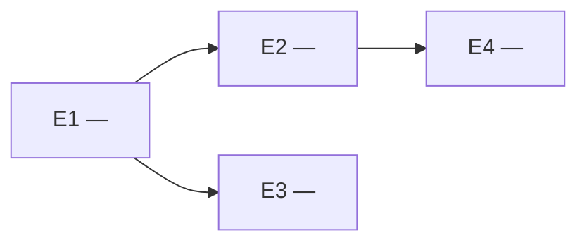

<!--
  TEMPLATE: Roadmap (visão macro)
  ───────────────────────────────
  Bridge entre a Matriz Técnica (o "o quê/porquê") e o Roadmap Detalhado
  (o "como", subetapa a subetapa).

  Este documento NÃO entra em subetapas nem em critérios de aceite — ele só
  desenha o MAPA das etapas: o que cada uma entrega, em que ordem, e qual o
  portão de conclusão de cada uma.

  Só gere este roadmap depois que a Matriz Técnica estiver "Validada" (Portão 1).

  Convenções:
    🤖  portão automático (CI determinístico decide)
    ⚠️  portão humano (hard-escala para o responsável)
    <...> substitua
-->

# Roadmap — <nome do módulo>

- **Status:** Rascunho
- **Versão:** v0.1
- **Baseado na Matriz Técnica:** v<X> (validada em AAAA-MM-DD)
- **Responsável:** <você>

---

## 1. Visão geral

<2–4 frases: a estratégia de sequência. Por que esta ordem? O que tem que vir
antes do quê e por quê (ex.: fundação de auth antes de qualquer feature).>

---

## 2. Mapa de dependências

<!-- Mostra o que bloqueia o quê e o que pode rodar em paralelo. -->

---

## 3. Etapas

| ID | Etapa | Objetivo | Entregável | Depende de | Portão | Status |
|----|-------|----------|------------|------------|--------|--------|
| E1 | <ex.: Fundação de segurança> | <auth + autorização do módulo> | <middleware + policies testados> | — | ⚠️ humano | ☐ |
| E2 | <ex.: CRUD de usuários> | <...> | <...> | E1 | 🤖 auto | ☐ |
| E3 | <...> | <...> | <...> | E1 | 🤖 auto | ☐ |
| E4 | <...> | <...> | <...> | E2 | ⚠️ humano | ☐ |

> 💡 Regra de portão: toda etapa que toca **auth, segredo ou dado pessoal/sensível**
> é ⚠️ humana por padrão. As demais podem ser 🤖 automáticas (CI verde conclui).

---

## 4. Marcos de revisão humana

<!-- Liste explicitamente os pontos onde a entrega PARA e espera por você. -->

- **Após E1:** ⚠️ revisar o modelo de autorização antes de liberar qualquer feature.
- **Após E<N>:** ⚠️ <motivo>.

---

## 5. Paralelização

- **Pode rodar em paralelo:** <ex.: E2 e E3, ambas dependem só de E1>
- **Serial obrigatório:** <ex.: E1 antes de tudo>

---

## 6. Critério de "módulo concluído"

- [ ] Todas as etapas com status concluído
- [ ] Todos os portões ⚠️ humanos assinados pelo responsável
- [ ] NFRs da matriz verificados (segurança, LGPD, performance)
- [ ] Nenhum segredo no histórico do repositório (scan limpo)
- [ ] README/documentação do módulo coerente com o que foi entregue
