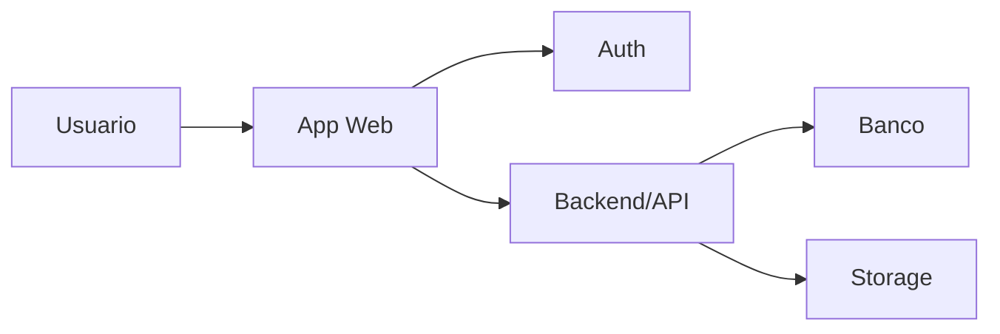
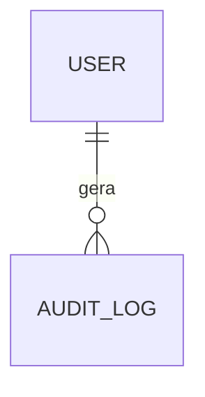

# Template - Especificacao Tecnica / Design Tecnico

Este e o artefato do Portao 3 do framework SDD. Ele traduz a Matriz Tecnica e o Roadmap Macro em desenho tecnico suficiente para gerar um Roadmap Detalhado executavel por agentes.

Regra de escopo:

- a matriz decide direcao, fronteiras e riscos;
- o design tecnico decide como o sistema sera desenhado;
- o roadmap detalhado decide como executar em subetapas;
- criterios de aceite e testes definidos aqui podem ser refinados no roadmap detalhado, mas nao devem contradizer a matriz.

## 1. Metadados E Status

| Campo | Valor |
| --- | --- |
| Projeto | `<nome do projeto>` |
| Escopo | `global` ou `modulo <X>` |
| Area solicitante | `<area ou cliente interno>` |
| Responsavel tecnico | `<nome>` |
| Status | `Rascunho` |
| Versao | `v0.1` |
| Data | `AAAA-MM-DD` |
| Baseado na Matriz | `<path + versao>` |
| Baseado no Roadmap Macro | `<path + versao>` |
| Artefato anterior | `Roadmap Macro` |
| Artefato seguinte | `Roadmap Detalhado` |

Status permitidos:

- `Rascunho`
- `Em revisao`
- `Validado`
- `Substituido`

## 2. Resumo Tecnico

`<Resumo de 5 a 10 linhas explicando a arquitetura proposta, principais componentes, padroes de seguranca, modelo de dados e estrategia de implementacao.>`

## 3. Decisoes Herdadas Da Matriz

| Decisao | Origem na matriz | Impacto tecnico | Observacoes |
| --- | --- | --- | --- |
| `<decisao>` | `<secao>` | `<impacto>` | `<observacao>` |

## 4. Arquitetura De Alto Nivel



### Componentes

| Componente | Responsabilidade | Tecnologia | Observacoes |
| --- | --- | --- | --- |
| `<componente>` | `<responsabilidade>` | `<tecnologia>` | `<observacao>` |

### Fronteiras Tecnicas

| Fronteira | Dado que atravessa | Risco | Controle |
| --- | --- | --- | --- |
| `<frontend -> backend>` | `<dados>` | `<risco>` | `<controle>` |

## 5. Modelo De Dados

### Entidades

| Entidade | Descricao | Dado pessoal? | Observacoes |
| --- | --- | --- | --- |
| `<Entidade>` | `<descricao>` | `<sim/nao>` | `<observacao>` |

### Relacionamentos



| Relacionamento | Cardinalidade | Regra | Obrigatorio? |
| --- | --- | --- | --- |
| `<A -> B>` | `<1:N/N:N>` | `<regra>` | `<sim/nao>` |

### Constraints E Integridade

| Entidade | Constraint | Motivo | Como validar |
| --- | --- | --- | --- |
| `<Entidade>` | `<unique/check/fk/not null>` | `<motivo>` | `<teste>` |

## 6. Schema Preliminar

> Opcional nesta fase, mas recomendado quando o projeto usa banco relacional.

```prisma
// Exemplo conceitual. Ajustar no schema real.
model User {
  id        String   @id @default(cuid())
  createdAt DateTime @default(now())
  updatedAt DateTime @updatedAt
}
```

Observacoes:

- `<ponto pendente>`

## 7. Modelo De Autorizacao Detalhado

### Papeis

| Papel | Descricao | Pode gerenciar permissoes? | Observacoes |
| --- | --- | --- | --- |
| `<papel>` | `<descricao>` | `<sim/nao>` | `<observacao>` |

### Permissoes Granulares

| Permissao | Modulo | Acao | Escopo | Descricao |
| --- | --- | --- | --- | --- |
| `<module:action>` | `<modulo>` | `<read/create/update/delete/approve>` | `<global/filial/proprio>` | `<descricao>` |

### Regras De Autorizacao

| Operacao | Permissao exigida | Escopo | Condicoes extras |
| --- | --- | --- | --- |
| `<operacao>` | `<permissao>` | `<escopo>` | `<condicoes>` |

## 8. Contratos De API / Server Actions

| Endpoint/Action | Metodo | Auth | Permissao | Input | Output | Erros |
| --- | --- | --- | --- | --- | --- | --- |
| `<rota/action>` | `<GET/POST/etc>` | `<sim>` | `<permissao>` | `<schema>` | `<schema>` | `<codigos>` |

Padrao obrigatorio:

- validar input com schema runtime;
- validar sessao/token no servidor;
- buscar usuario interno;
- validar status ativo;
- validar permissao e escopo;
- executar operacao;
- auditar quando aplicavel;
- retornar erro seguro.

## 9. Validacoes De Dominio

| Dominio | Regra | Onde validar | Erro esperado |
| --- | --- | --- | --- |
| `<dominio>` | `<regra>` | `<backend/db/frontend>` | `<erro>` |

## 10. Storage E Arquivos

| Tipo de arquivo | Path/organizacao | Quem pode enviar | Quem pode ler | Retencao | Observacoes |
| --- | --- | --- | --- | --- | --- |
| `<tipo>` | `<path>` | `<permissao>` | `<permissao>` | `<prazo>` | `<observacao>` |

Controles obrigatorios:

- arquivo privado por padrao;
- path gerado pelo servidor;
- tipo e tamanho validados;
- metadados persistidos no banco;
- URL assinada/proxy autorizado quando necessario;
- auditoria de upload, leitura sensivel e remocao.

## 11. Auditoria E Logs

| Acao | Entidade | Evento de auditoria | Campos minimos |
| --- | --- | --- | --- |
| `<acao>` | `<entidade>` | `<evento>` | `<actor, timestamp, entityId, before/after, requestId>` |

Padroes:

- logs tecnicos nao devem expor tokens, senhas ou documentos completos;
- auditoria deve registrar ator real do servidor, nao `userId` vindo do client;
- acoes destrutivas, financeiras, permissao, status e arquivos sensiveis devem ser auditadas.

## 12. Tratamento De Erros

| Cenario | Mensagem ao usuario | Log interno | Status/codigo |
| --- | --- | --- | --- |
| `<cenario>` | `<mensagem segura>` | `<detalhe interno>` | `<codigo>` |

Principios:

- erro tecnico nao vaza para usuario final;
- erro de autorizacao nao revela existencia de recurso sensivel;
- logs internos devem ter contexto suficiente para investigacao.

## 13. Regras De UI Tecnica

| Area | Padrao | Observacoes |
| --- | --- | --- |
| Estados | loading, vazio, erro, sem permissao | `<observacao>` |
| Acoes destrutivas | dialog customizado | proibido `alert`/`confirm` nativo |
| Formularios | validacao client-side e server-side | client melhora UX, server decide |
| Dados sensiveis | mascarar quando aplicavel | `<observacao>` |

## 14. Integracoes Tecnicas

| Integracao | Fluxo | Credencial | Ambiente | Risco | Controle |
| --- | --- | --- | --- | --- | --- |
| `<integracao>` | `<fluxo>` | `<secret/env/nenhuma>` | `<dev/hml/prod>` | `<risco>` | `<controle>` |

## 15. Testes Tecnicos Esperados

| Tipo | Arquivo/Suite | O que cobre | Obrigatorio para |
| --- | --- | --- | --- |
| Unit | `<path>` | `<regra>` | `<modulo>` |
| Integration | `<path>` | `<API/db/auth>` | `<modulo>` |
| E2E/Smoke | `<path>` | `<fluxo>` | `<release>` |
| Security | `<path/scan>` | `<auth/secrets/upload>` | `<gate>` |

## 16. Gates Tecnicos

| Gate | Tipo | Quando aplica | Evidencia |
| --- | --- | --- | --- |
| `<gate>` | `<AUTO/HUMANO/BLOQUEADO>` | `<condicao>` | `<teste/revisao>` |

Gates humanos obrigatorios quando houver:

- auth/autorizacao;
- segredo;
- dado pessoal;
- dado financeiro;
- storage privado;
- migracao destrutiva;
- permissao ou papel;
- integracao externa sensivel.

## 17. ADRs E Decisoes Tecnicas

| Decisao | ADR | Status | Criticidade | Reversibilidade |
| --- | --- | --- | --- | --- |
| `<decisao>` | `<path>` | `<proposto/aceito/rejeitado>` | `<alta/media/baixa>` | `<facil/media/dificil>` |

## 18. Riscos Tecnicos E Mitigacoes

| Risco | Impacto | Probabilidade | Mitigacao | Dono |
| --- | --- | --- | --- | --- |
| `<risco>` | `<impacto>` | `<alta/media/baixa>` | `<mitigacao>` | `<responsavel>` |

## 19. Pendencias Para Roadmap Detalhado

| Pendencia | Por que importa | Bloqueia roadmap detalhado? | Responsavel |
| --- | --- | --- | --- |
| `<pendencia>` | `<motivo>` | `<sim/nao>` | `<responsavel>` |

## 20. Criterios De Aceite Do Design Tecnico - Portao 3

Antes de gerar roadmap detalhado, validar:

- [ ] Arquitetura e fronteiras tecnicas estao claras.
- [ ] Modelo de dados esta suficiente para iniciar schema/migrations.
- [ ] Regras de autorizacao granular estao definidas.
- [ ] Contratos de API/Server Actions estao definidos em nivel suficiente.
- [ ] Validacoes de dominio estao documentadas.
- [ ] Estrategia de storage e arquivos esta definida.
- [ ] Auditoria e logs estao definidos para acoes criticas.
- [ ] Tratamento de erros tem padrao seguro.
- [ ] Testes tecnicos esperados estao mapeados.
- [ ] Gates tecnicos e humanos estao definidos.
- [ ] ADRs necessarios foram criados ou listados.
- [ ] Pendencias nao bloqueiam indevidamente o roadmap detalhado.
- [ ] Validado por `<responsavel tecnico>` em `AAAA-MM-DD`.

## 21. Historico De Alteracoes

| Versao | Data | Autor | Mudanca | Status resultante |
| --- | --- | --- | --- | --- |
| `v0.1` | `AAAA-MM-DD` | `<nome>` | `Criacao inicial` | `Rascunho` |
